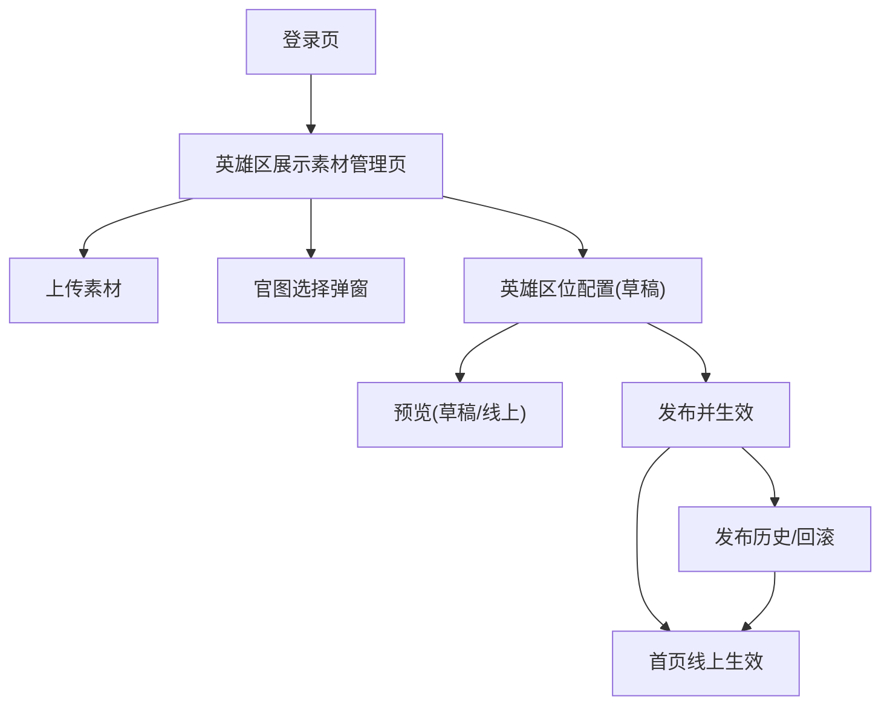

## 1. Product Overview
将后台“首页轮播图管理”改造为“首页英雄区展示素材”管理。
支持上传图片/视频、从车型官图库选择素材，并由任一管理员即时发布生效（无审核流程）。

## 2. Core Features

### 2.1 User Roles
| 角色 | 注册/开通方式 | 核心权限 |
|------|----------------|----------|
| 管理员（Admin） | 由超级管理员开通/授权 | 素材上传/编辑、从车型官图选择、配置英雄区草稿、立即发布生效、回滚、下线素材、查看操作日志 |
| 超级管理员（Super Admin） | Supabase 管理后台创建/授权 | 拥有全部权限（含账号管理与权限分配等） |

### 2.2 Feature Module
本次需求包含以下页面：
1. **登录页**：账号登录、会话保持、无权限提示。
2. **英雄区展示素材管理页**：素材库（上传/官图选择）、英雄区位配置、预览、立即发布、发布历史与回滚。

### 2.3 Page Details
| Page Name | Module Name | Feature description |
|---|---|---|
| 登录页 | 登录表单 | 输入邮箱/密码登录；登录成功后跳转管理页；失败提示原因 |
| 登录页 | 会话与退出 | 保持登录态；支持退出登录 |
| 英雄区展示素材管理页 | 素材库列表 | 查看素材（图片/视频）列表：缩略图、类型、来源（上传/官图）、创建人、创建时间、状态（草稿/已发布/已下线） |
| 英雄区展示素材管理页 | 上传素材 | 上传图片/视频；填写基础信息（标题/alt/适配端：桌面优先）；生成预览缩略图；校验格式与大小 |
| 英雄区展示素材管理页 | 从车型官图选择 | 按车型/车系筛选官图；多选加入素材库；保留来源与关联车型信息 |
| 英雄区展示素材管理页 | 素材编辑与下线 | 编辑素材元信息；下线素材（不影响历史发布版本，但不可再被新版本选用） |
| 英雄区展示素材管理页 | 英雄区位配置（草稿） | 配置英雄区展示位（例如 1–N 个）：选择素材、排序、跳转链接、标题/副标题/按钮文案、排期（start/end） |
| 英雄区展示素材管理页 | 预览 | 在后台预览“当前草稿”与“线上版本”；提供桌面优先预览比例与安全区提示 |
| 英雄区展示素材管理页 | 发布 | 管理员填写变更说明后一键发布生效；发布时生成新版本并记录发布人/时间 |
| 英雄区展示素材管理页 | 发布历史与回滚 | 查看历史版本列表、发布人/时间/说明；支持回滚到任一历史版本并立即生效 |
| 英雄区展示素材管理页 | 权限与审计 | 不同角色可见/可操作按钮差异；记录关键操作日志（上传/编辑/提交/发布/回滚/下线） |

## 3. Core Process
### 3.1 编辑与发布流程（Admin）
1) 管理员进入“英雄区展示素材管理”，上传图片/视频或从车型官图库选择素材。
2) 在“英雄区位配置（草稿）”中选定素材、排序、配置文案/链接与排期。
3) 编辑完成后点击“发布”，填写变更说明，生成新的“已发布版本”，首页立即生效。
4) 如需紧急处理：管理员可从“发布历史”回滚到历史版本，回滚后立即生效。

### 3.2 发布生效规则（与排期）
- 首页仅读取“已发布版本”中的展示位配置。
- 展示位是否渲染需同时满足：版本为线上、素材未下线、且在排期区间内（start_at ≤ now < end_at；若 end_at 为空则视为长期）。

