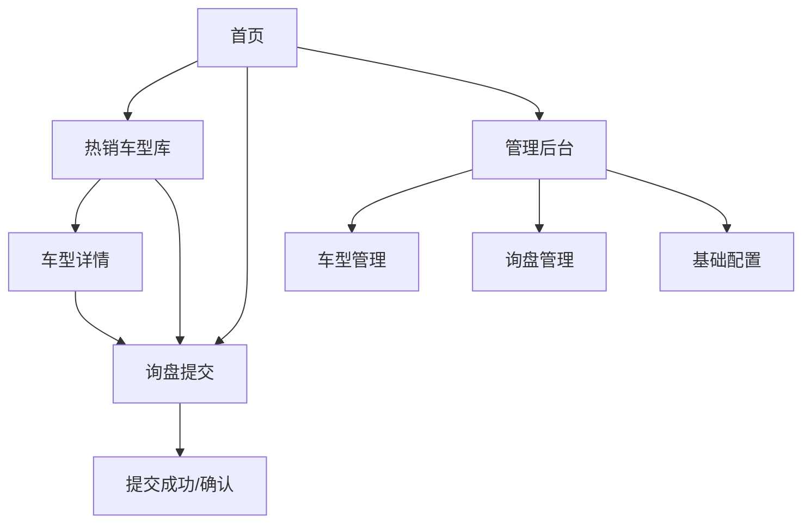

## 1. Product Overview
“呦鹿鸣”B2B汽车批量出口独立站，用于向海外采购商展示热销车型并快速收集批量询盘。
核心价值：用标准化车型库 + 结构化询盘表单，提高线索质量与跟进效率。

## 2. Core Features

### 2.0 多语言与RTL要求（必须）
- 站点需要支持语言切换：中文、英文、俄文、阿拉伯文、泰文、老挝文、波斯文、土耳其文、库尔德文、乌兹别克文、哈萨克文、吉尔吉斯文、塔吉克文、土库曼文、普什图文、乌尔都文、希伯来文、亚美尼亚文、格鲁吉亚文。
- 语言选择器：全站固定（Header 右侧），可在任意页面切换语言且保持当前页面路径。
- 默认语言：优先使用浏览器语言自动匹配（命中支持列表则使用；否则回落英文），并持久化到本地（localStorage）。
- RTL 支持：阿拉伯文、波斯文、普什图文、乌尔都文、希伯来文必须启用 `dir=rtl`，其余为 `dir=ltr`；切换语言时需要动态切换布局方向。
- 内容多语言：车型名称/概要/详情描述、站点关键文案（如CTA、表单标签）需要具备多语言能力（可先覆盖中英，其他语言允许回落英文，但切换必须可用且 RTL 生效）。

### 2.1 User Roles
| 角色 | 注册方式 | 核心权限 |
|------|----------|----------|
| 访客/采购商 | 无需注册（匿名访问） | 浏览热销车型库与详情；提交询盘 |
| 管理员 | Supabase Auth 邮箱+密码 | 管理车型与图片；查看/处理询盘；维护基础配置 |

### 2.2 Feature Module
本独立站需求由以下主要页面构成：
1. **首页**：品牌主视觉、核心卖点、热销车型入口、询盘入口、基础信任背书。
2. **热销车型库**：车型列表、筛选/搜索、对比/快速询盘入口。
3. **车型详情**：图片与关键参数、装运/贸易信息、关联车型、发起询盘。
4. **询盘提交**：结构化表单（需求/数量/目的港等）、提交确认与后续指引。
5. **管理后台**：车型管理、图片管理、询盘管理（状态流转/备注）、基础配置。

### 2.3 Page Details
| Page Name | Module Name | Feature description |
|-----------|-------------|---------------------|
| 首页 | 顶部导航与主视觉 | 展示Logo/导航（车型库/询盘/关于信息锚点）；呈现品牌主视觉与核心Slogan。 |
| 首页 | 核心卖点与信任背书 | 展示出口能力/交付流程要点、资质与合作要素（文本+图标）；提供联系信息入口。 |
| 首页 | 热销车型推荐 | 展示精选热销车型卡片（图、车名、基础信息、按钮）；跳转车型库/详情。 |
| 首页 | 快速询盘入口 | 提供“批量询盘”主CTA，进入询盘提交页；支持携带已选车型。 |
| 热销车型库 | 列表与卡片展示 | 按卡片网格展示车型（封面图、名称、价格区间/FOB参考、交付周期标签等）。 |
| 热销车型库 | 筛选与搜索 | 支持按品牌/级别/能源类型/年份/库存状态/价格区间筛选；关键词搜索车型名称。 |
| 热销车型库 | 选型与发起询盘 | 支持选择1-N个车型加入“询盘清单”；一键进入询盘提交并带入车型。 |
| 车型详情 | 图片与关键参数 | 展示多图轮播；展示关键参数（排量/座位/能源/变速箱等）；提供下载/复制关键信息。 |
| 车型详情 | 贸易与装运信息 | 展示可选贸易条款（如FOB/CIF文本化说明）、可交付港口/交付周期说明（由管理员配置）。 |
| 车型详情 | 询盘CTA | “获取批量报价/可用库存”按钮，进入询盘提交并预选当前车型。 |
| 询盘提交 | 表单（结构化线索） | 收集：公司/联系人/邮箱/WhatsApp(可选)/国家地区；需求：车型（多选）、数量、目的港、期望条款、目标到港时间、备注。 |
| 询盘提交 | 提交与确认 | 校验必填；提交成功后展示询盘编号、预计响应时间与联系方式；支持返回车型库继续浏览。 |
| 管理后台 | 管理员登录与访问控制 | 仅管理员可访问；未登录跳转登录界面（同一路由内实现）。 |
| 管理后台 | 车型管理 | 新增/编辑/上下架车型；维护关键参数与标签（热销/新品/现货）。 |
| 管理后台 | 图片与素材管理 | 上传/删除车型图片；设置封面图与排序。 |
| 管理后台 | 询盘管理 | 查看询盘列表与详情；维护状态（新建/已联系/报价中/已成交/无效）；添加内部备注；导出CSV。 |
| 管理后台 | 基础配置 | 维护可选港口、贸易条款文案、联系信息（用于前台展示与表单默认值）。 |

## 3. Core Process
**采购商（访客）流程**：
1) 从首页进入热销车型库，使用筛选/搜索定位目标车型；
2) 查看车型详情，确认关键参数与交付信息；
3) 选择单个或多个车型进入询盘提交，填写数量、目的港与联系信息；
4) 提交后获得询盘编号与后续沟通指引。

**管理员流程**：
1) 登录管理后台；
2) 维护车型库与图片，确保“热销车型”持续更新；
3) 处理新询盘：补充备注、更新状态、跟进沟通与报价；
4) 根据成交流程沉淀有效车型与标签策略。

