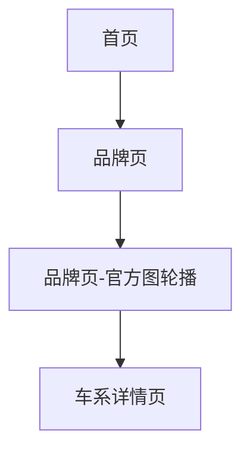

## 1. Product Overview
对「品牌页」进行一次整体视觉与布局的全新改版：不沿用现有页面样式，并与新版「车系详情页/车型详情页」的视觉语言保持一致。
品牌页顶部轮播继续使用“后台上传的官方图”，且轮播卡片可点击跳转到对应车系。

## 2. Core Features

### 2.1 Feature Module
本次需求涉及以下页面：
1. **品牌页**：全新视觉框架、官方图轮播（品牌+车系）、点击跳转车系。
2. **车系详情页**：承接从品牌页轮播的跳转并展示车系内容（页面能力保持不变）。

### 2.2 Page Details
| Page Name | Module Name | Feature description |
|---|---|---|
| 品牌页 | 视觉与布局重构 | 使用与新版车系/车型详情页一致的颜色、字体、卡片、按钮与动效规范；不沿用现有品牌页样式；保持页面可读性与信息层级清晰。 |
| 品牌页 | 轮播数据组装（官方图） | 基于“后台上传的官方图”生成轮播数据：每个品牌从其可用的官方图资源池中随机选取1张展示；无可用官方图则使用兜底图。 |
| 品牌页 | 轮播展示（品牌 + 车系文案） | 展示轮播卡片：主图为随机官方图；文案展示“品牌名 + 车系名”；支持左右切换/自动轮播（保持现有轮播交互习惯）。 |
| 品牌页 | 轮播点击跳转车系 | 点击任一轮播卡片，跳转到对应车系详情页，并携带车系唯一标识参数。 |
| 品牌页 | 状态与容错 | 加载中展示骨架屏；加载失败/无数据时展示空状态与返回入口；图片加载失败使用兜底图。 |
| 车系详情页 | 页面承接 | 接收来自品牌页的车系标识并正确加载车系内容；其余功能保持不变。 |

## 3. Core Process
**访客浏览流程**
1) 你从首页进入品牌页。
2) 你在品牌页顶部轮播看到“官方图 + 品牌名 + 车系名”。
3) 你点击感兴趣的轮播卡片，页面跳转到对应车系详情页继续浏览。

