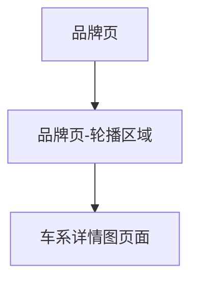

## 1. Product Overview
品牌页轮播模块改版：轮播中每个品牌展示一张随机官方图，并展示“品牌 + 车系”文案。
用户点击轮播项后，跳转到对应车系的详情图页面，提升浏览与到达效率。

## 2. Core Features

### 2.1 Feature Module
本次需求涉及以下页面：
1. **品牌页**：品牌轮播（随机官方图、品牌+车系文案、点击跳转）。
2. **车系详情图页面**：承接落地展示对应车系的详情图内容。

### 2.2 Page Details
| Page Name | Module Name | Feature description |
|-----------|-------------|---------------------|
| 品牌页 | 轮播数据组装 | 拉取轮播所需的品牌、车系及其官方图资源列表；为每个品牌从其官方图中随机选取1张用于展示（若无可用官方图则使用兜底图）。 |
| 品牌页 | 轮播展示 | 展示轮播卡片：图片为随机官方图；文案显示“品牌名 + 车系名”；支持左右切换/拖拽切换（如现有轮播已支持则保持一致）。 |
| 品牌页 | 点击跳转 | 点击任一轮播卡片，跳转到对应“车系详情图页面”，并携带目标车系的唯一标识参数。 |
| 车系详情图页面 | 页面承接 | 根据入参车系标识加载并展示该车系详情图内容（页面已有能力则保持不变，仅确保可从轮播正确到达）。 |

## 3. Core Process
用户进入品牌页后，看到轮播中每个品牌的随机官方图及“品牌 + 车系”文案；当用户对某个车系感兴趣时，点击对应轮播卡片，系统跳转到该车系的详情图页面进行进一步浏览。

