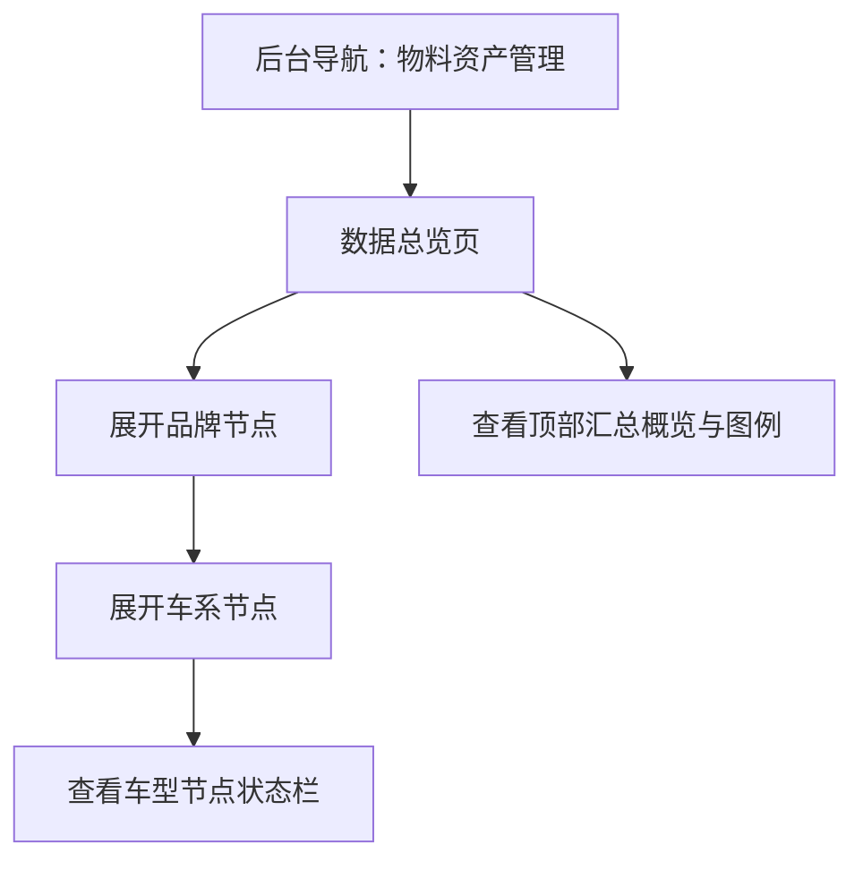

## 1. Product Overview
在管理后台的物料资产管理中新增「数据总览」页面，用可展开的树形/思维导图方式汇总品牌→车系→车型的数据物料完备情况。
帮助你快速发现不同层级下外观VR、内饰VR、官图、外观/内饰图片、详细参数等物料是否齐全。

## 2. Core Features

### 2.1 User Roles
| 角色 | 注册/登录方式 | 核心权限 |
|------|----------------|----------|
| 后台运营/内容管理员 | 后台账号登录 | 可查看数据总览与各节点物料存在状态 |

### 2.2 Feature Module
本次需求包含以下核心页面：
1. **数据总览页**：品牌→车系→车型树形/思维导图展示、各层级节点物料状态栏、状态图例与汇总；支持节点状态修改、物料图组删除、多选右键批量操作。

### 2.3 Page Details
| Page Name | Module Name | Feature description |
|-----------|-------------|---------------------|
| 数据总览页 | 页面入口与权限 | 从物料资产管理模块进入；仅已登录且具备后台权限用户可访问 |
| 数据总览页 | 层级树/思维导图 | 展示品牌→车系→车型三级结构；支持节点展开/收起；支持懒加载子节点以保证性能 |
| 数据总览页 | 节点标题信息 | 在节点上展示名称与层级标识（品牌/车系/车型）；支持长名称省略与悬停完整展示 |
| 数据总览页 | 节点状态栏 | 在品牌/车系/车型节点下显示物料存在状态：外观VR、内饰VR、官图、外观图、内饰图、详细参数；用统一的状态样式表达“存在/缺失/未知(无数据)” |
| 数据总览页 | 父级状态汇总规则 | 品牌/车系节点的各项状态根据其子级（车系/车型）汇总计算：全部存在=存在；存在缺失混合=部分缺失；全部缺失=缺失；无子数据=未知 |
| 数据总览页 | 汇总概览与图例 | 在页面顶部展示各物料类型的“存在/缺失/未知”数量概览；提供颜色/标识图例说明，确保你能快速理解状态含义 |
| 数据总览页 | 节点状态可编辑 | 你可在品牌/车系/车型节点的状态栏中直接修改状态（例如：外观VR从缺失改为存在；或将车型状态从正常改为不可用）；修改应立即保存并反馈成功/失败 |
| 数据总览页 | 图组删除 | 你可删除节点下的外观VR/内饰VR/官图/外观图/内饰图等图组资源；删除后状态自动变更为缺失（或按规则重新计算）；支持单节点删除与批量删除 |
| 数据总览页 | 多选与右键批量操作 | 支持按 Ctrl/⌘ 多选、Shift 连选；右键打开批量菜单：批量修改状态、批量删除图组（按物料类型） |
| 数据总览页 | 空/错/加载态 | 无数据时展示空态说明；加载中显示骨架/加载提示；接口失败显示错误提示与重试 |

## 4. Interaction Rules

### 4.1 Selection
- 单击节点：选中该节点（清空其他选择）。
- Ctrl/⌘ + 单击：追加/取消选择。
- Shift + 单击：在同一父级的可见节点间进行范围选择。
- 点击空白处：清空选择。

### 4.2 Context Menu
- 右键在某节点上：
  - 若该节点未被选中：先选中该节点，再打开菜单。
  - 若该节点已被选中：对当前已选集合生效。
- 菜单项：
  - 批量修改：节点状态（正常/不显示/不可用）、以及各物料类型状态（存在/缺失/未知）。
  - 批量删除：外观VR、内饰VR、官图、外观图、内饰图（对不适用层级的项置灰）。

### 4.3 Status Definition
- 节点状态（通用）：正常 / 不显示 / 不可用。
- 物料状态（各物料类型）：存在 / 缺失 / 未知。
- 父级汇总：按已加载的子级数据实时计算；若子级未加载则显示未知并提示“展开后将更新”。

### 4.4 Deletion Rules
- 删除图组：删除对应物料记录及其 Storage 文件（如存在）。
- 删除后 UI：即时从树节点中移除预览/计数，并将对应物料状态标记为缺失（或重新汇总）。
- 风险提示：删除为不可逆操作，需二次确认。

## 3. Core Process
你在后台进入「物料资产管理 → 数据总览」。页面默认展示品牌列表；你展开某个品牌后看到其车系，再展开车系看到车型。
你通过各节点下的状态栏快速定位缺失的物料类型（如某车型缺外观VR或详细参数），从而指导后续补齐。

