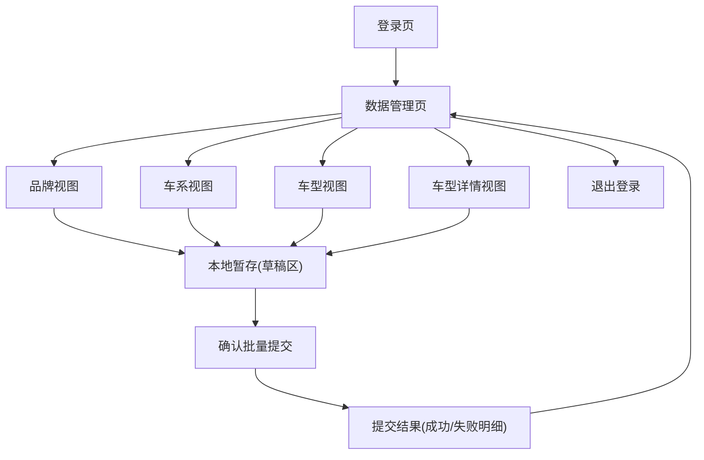

## 1. Product Overview
面向管理后台的「品牌 / 车系 / 车型 / 车型详情」数据库视图提供可用的增删改查界面。
支持在前端本地暂存多笔修改，点击“确认”后一次性批量写入数据库并返回结果。

## 2. Core Features

### 2.1 User Roles
| 角色 | 注册/登录方式 | 核心权限 |
|------|----------------|----------|
| 管理员 | Supabase Auth 登录（邮箱/密码或企业 SSO，按项目配置） | 可进入管理后台；对品牌/车系/车型/车型详情执行增删改查；可本地暂存并批量提交 |

### 2.2 Feature Module
本管理后台需求由以下主页面构成：
1. **登录页**：账号登录、登录态保持、无权限拦截。
2. **数据管理页（品牌/车系/车型/车型详情）**：四类数据视图切换、列表查询、表格编辑增删改、本地暂存、批量确认写库、提交结果展示。

### 2.3 Page Details
| Page Name | Module Name | Feature description |
|-----------|-------------|---------------------|
| 登录页 | 账号登录 | 输入邮箱/密码并登录；失败时提示原因；成功后跳转数据管理页 |
| 登录页 | 登录态维护 | 检测已登录会话并自动进入后台；未登录访问后台时重定向登录 |
| 数据管理页 | 顶部导航 | 展示产品名称/环境标识；提供退出登录 |
| 数据管理页 | 视图切换（4 类实体） | 在“品牌/车系/车型/车型详情”四个视图间切换；保持各视图的筛选与分页状态（同一会话内） |
| 数据管理页 | 列表查询（查） | 支持关键字段搜索；支持按常用字段排序；支持分页；支持按上级实体过滤（例如在车系视图按品牌过滤、车型视图按车系过滤、详情视图按车型过滤） |
| 数据管理页 | 行内编辑（改） | 在表格内编辑可编辑字段；字段校验（必填/长度/数值范围等）；标记“已修改未提交”状态 |
| 数据管理页 | 新增记录（增） | 通过“新增”在表格顶部或弹窗创建；允许先生成本地临时记录并进入“未提交”状态 |
| 数据管理页 | 删除记录（删） | 支持删除单条；对已存在记录的删除进入“未提交”状态；对本地新增未提交记录可直接移除 |
| 数据管理页 | 本地暂存（草稿区） | 统一汇总本次会话所有未提交变更（新增/修改/删除）；展示变更数量、按实体分组、逐条查看变更 diff；支持撤销单条变更、撤销全部变更 |
| 数据管理页 | 批量确认写库 | 点击“确认”后一次性提交草稿区全部变更；提交前二次确认；提交中禁用编辑并显示进度 |
| 数据管理页 | 提交结果与冲突提示 | 展示成功/失败条目与原因；失败条目保留在草稿区以便修复后再次提交；对版本冲突/不存在/约束失败给出可操作提示 |

## 3. Core Process
**管理员流程**
1) 管理员访问后台，若未登录则进入登录页完成认证。
2) 进入数据管理页，选择视图（品牌/车系/车型/车型详情），通过搜索/过滤/分页定位目标数据。
3) 进行新增、编辑、删除；所有变更先进入“本地暂存（草稿区）”，不立即写入数据库。
4) 在草稿区检查变更内容，必要时撤销部分或全部修改。
5) 点击“确认”提交，将草稿区所有变更一次性写入数据库；系统返回逐条结果。
6) 若存在失败项，管理员根据提示修复后再次点击“确认”重试。

