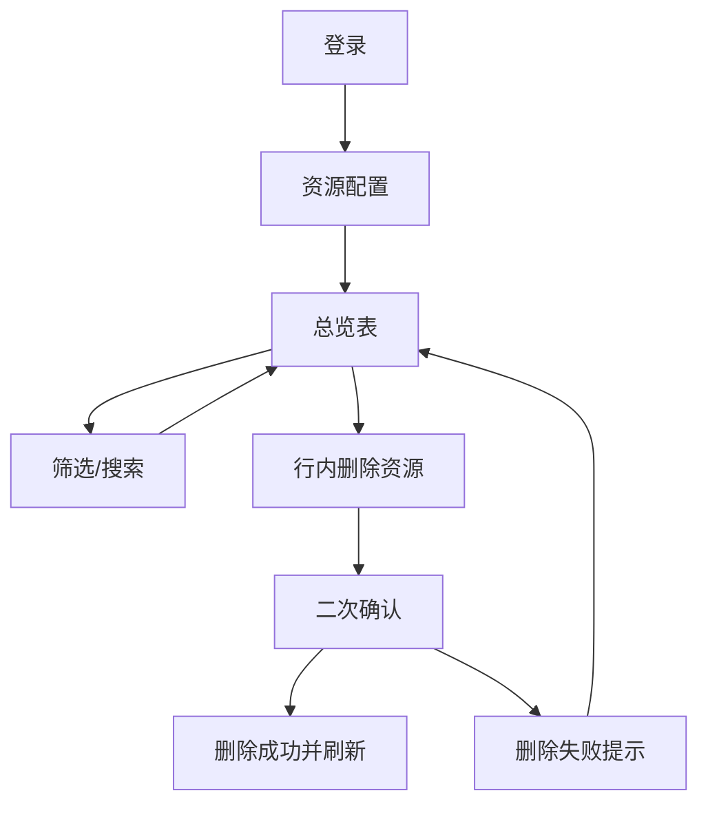

## 1. Product Overview
在资源配置模块中新增“总览表”页面，按品牌/车系汇总 VR 与图片资源的存在情况与分类统计。
支持在表格内直接删除资源，用于日常资源治理与缺失补齐。

## 2. Core Features

### 2.1 User Roles
| 角色 | 注册/登录方式 | 核心权限 |
|------|--------------|----------|
| 运营/内容管理员 | 后台账号登录 | 查看总览表、筛选查询、删除 VR/图片资源 |
| 超级管理员 | 后台账号登录 | 具备运营权限；可配置资源分类口径（如已有配置能力则复用） |

### 2.2 Feature Module
本需求涉及的核心页面如下：
1. **资源配置-总览表**：品牌/车系聚合列表、资源存在状态、分类统计、表格内删除。

### 2.3 Page Details
| Page Name | Module Name | Feature description |
|-----------|-------------|---------------------|
| 资源配置-总览表 | 页面入口/导航 | 从“资源配置”模块进入；高亮当前页面；保留面包屑定位。 |
| 资源配置-总览表 | 查询与筛选 | 按品牌/车系筛选；支持关键字搜索（品牌/车系）；支持重置筛选；展示当前筛选条件。 |
| 资源配置-总览表 | 聚合表格（品牌/车系维度） | 展示每个品牌/车系下：车型数量、VR 资源“有/无”与数量、图片资源“有/无”与数量；展示图片按分类统计（分类口径以系统现有分类为准）。 |
| 资源配置-总览表 | 行内资源管理（删除） | 在表格行内对 VR 或图片发起删除；弹出二次确认；删除成功后刷新该行聚合数据与统计；失败时提示原因。 |
| 资源配置-总览表 | 风险控制与权限 | 仅有权限用户可见“删除”入口；对删除操作进行明确的不可逆提示（如为硬删除）。 |
| 资源配置-总览表 | 空态/加载/错误态 | 首次进入加载态；无数据空态；查询失败提供重试。 |

## 3. Core Process
- 运营/内容管理员流程：登录后台 → 进入资源配置 → 打开“总览表” → 按品牌/车系筛选查看资源存在情况与分类统计 → 在表格行内选择删除 VR 或图片 → 二次确认 → 系统执行删除并刷新统计。

