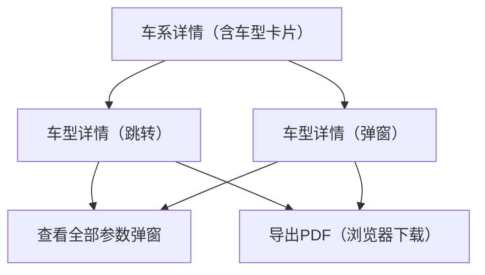

## 1. Product Overview
从车系详情卡片进入“车型详情”，集中展示车型多媒体（360/内饰VR、官方图/实拍图）、重点参数，并支持一键导出PDF。
面向意向采购/销售展示场景，降低沟通成本，提升信息完整度与可分享性。

## 2. Core Features

### 2.1 Feature Module
本需求包含以下核心页面：
1. **车系详情（含车型卡片）**：车型卡片列表；打开车型详情（弹窗或跳转）。
2. **车型详情**：360/内饰VR切换区；官方图/实拍图分区；重点参数；查看全部参数弹窗；导出PDF。

### 2.3 Page Details
| Page Name | Module Name | Feature description |
|-----------|-------------|---------------------|
| 车系详情（含车型卡片） | 车型卡片列表 | 展示车系下的车型卡片；点击卡片打开对应“车型详情”（支持弹窗或跳转）。 |
| 车型详情 | 基础信息区 | 展示车型名称/车系/基础标签（如年份/配置名等，以数据源为准）；提供返回/关闭入口（跳转返回或弹窗关闭）。 |
| 车型详情 | 360/内饰VR切换区 | 在同一区域提供两种媒体模式切换：360外观与内饰VR；默认展示一种模式并允许切换；媒体加载失败时给出占位与重试入口。 |
| 车型详情 | 官方图分区 | 以网格/轮播方式展示官方图；支持点击预览大图与左右切换。 |
| 车型详情 | 实拍图分区 | 以网格/轮播方式展示实拍图；支持点击预览大图与左右切换。 |
| 车型详情 | 重点参数区 | 展示若干“重点参数”（数量与字段由配置/数据决定）；提供“查看全部参数”入口。 |
| 车型详情 | 查看全部参数弹窗 | 弹窗展示完整参数清单（分组+可滚动）；支持关闭；在弹窗内保持车型信息一致性（标题/车型名）。 |
| 车型详情 | 导出PDF | 提供“导出PDF”按钮；导出内容至少包含：车型基础信息、当前媒体区截图/首帧、官方图/实拍图（可选首图或缩略图）、重点参数与完整参数（可配置）；导出前展示生成中状态，导出成功触发下载。 |

## 3. Core Process
**用户流程（采购/销售通用）**
1. 你在车系详情页浏览车型卡片。
2. 你点击某张车型卡片，打开车型详情（以弹窗或新页面形式）。
3. 你在车型详情中切换查看“360外观/内饰VR”。
4. 你分别浏览官方图与实拍图分区。
5. 你查看重点参数，点击“查看全部参数”打开参数弹窗，阅读后关闭。
6. 你点击“导出PDF”，等待生成完成后下载并用于分享。

