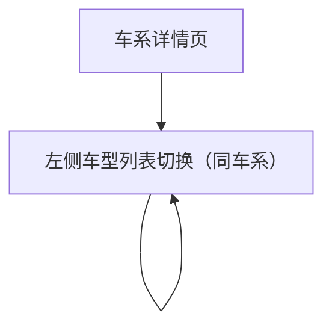

## 1. Product Overview
车型详情页重构：取消 VR 展示，采用「左侧同车系车型列表 / 中间图片展示 / 右侧主要参数对比」三栏结构。
面向浏览车型的访客，帮助你在同一车系内快速切换车型并对比关键参数（不超过 12 项）。

## 2. Core Features

### 2.1 Feature Module
本次重构涉及以下页面：
1. **车系详情页**：进入指定车型详情；承接车系内车型入口。
2. **车型详情页（重构）**：左侧车型切换；中间图片展示；右侧关键参数对比（≤12项）。

### 2.2 Page Details
| Page Name | Module Name | Feature description |
|---|---|---|
| 车系详情页 | 车型入口 | 从车系内车型列表进入车型详情页，并带上车系上下文（用于详情页左侧同车系车型列表展示）。 |
| 车型详情页（重构） | 页面骨架（三栏） | 以三栏布局呈现：左侧车型列表、中间图片展示、右侧参数对比；移除 VR 相关区域与入口。 |
| 车型详情页（重构） | 左侧：同车系车型列表 | 展示同车系全部车型（名称/年款等必要标识）；点击切换当前车型，刷新中间图片与右侧参数对比内容；高亮当前选中车型。 |
| 车型详情页（重构） | 中间：图片展示 | 展示当前车型图片（主图为核心）；支持切换图片（如缩略图/上一张下一张，形式不限但需可用）；图片加载失败时展示占位与重试入口。 |
| 车型详情页（重构） | 右侧：主要参数对比（≤12项） | 以不超过 12 个核心参数项展示/对比当前车型与同车系其它车型的差异（对比对象为左侧列表中的车型）；当可用参数项超过 12 时，仅显示约定的 12 项（按业务优先级固定）。 |
| 车型详情页（重构） | 状态与容错 | 数据加载中展示骨架屏；接口失败提示错误与重试；无图片/无参数时展示空状态文案。 |

## 3. Core Process
### 3.1 访客浏览与切换流程
1. 你从车系详情页点击某个车型进入车型详情页。
2. 车型详情页加载后：
   - 左侧展示同车系车型列表，并默认选中当前车型。
   - 中间展示当前车型图片。
   - 右侧展示主要参数对比（不超过 12 项）。
3. 你点击左侧的其他车型：
   - 当前车型切换，高亮随之变化。
   - 中间图片展示更新为新车型。
   - 右侧参数对比更新为新车型对应数据，且参数项数量始终 ≤12。

### 3.2 页面导航流程图

