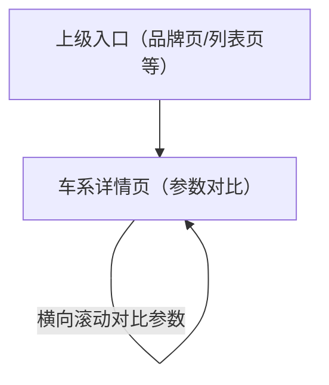

## 1. Product Overview
将「车系详情页」的车型列表区改为“按年款分组的横向参数对比表”，并在页面顶部优先展示 VR，以提升选型效率与信息可比性。

## 2. Core Features

### 2.1 Feature Module
本次改版需求由以下页面构成：
1. **车系详情页（参数对比）**：顶部 VR 优先展示、年款分组切换、横向对比表（不显示图片）。

### 2.2 Page Details
| Page Name | Module Name | Feature description |
|---|---|---|
| 车系详情页（参数对比） | 页面加载与异常处理 | 展示加载态；加载失败/无数据时展示错误态与返回入口 |
| 车系详情页（参数对比） | 顶部 VR 展示区（优先） | 优先展示 VR 内容；当 VR 不可用时展示兜底占位（不影响下方对比功能可用） |
| 车系详情页（参数对比） | 车系基础信息区 | 展示品牌名/车系名等基础信息（与现有信息保持一致） |
| 车系详情页（参数对比） | 年款分组导航 | 按“年款”对车型分组；提供分组切换入口；默认展示最新年款分组 |
| 车系详情页（参数对比） | 横向参数对比表（核心） | 将车型以“列”方式横向展示；以“参数项”为行展示对比；支持横向滚动以查看所有车型列；列表区不展示任何车型图片 |
| 车系详情页（参数对比） | 表格字段呈现规则 | 仅展示有数据的参数项/分组；缺失值用“—”呈现；同字段在同一行内对齐便于对比 |
| 车系详情页（参数对比） | 空数据提示 | 当当前年款分组下无车型或无参数数据时展示空状态与返回入口 |

## 3. Core Process
**访客对比选型流程**
1) 你从上级入口进入车系详情页。
2) 你在页面顶部优先查看 VR（若存在）。
3) 你通过年款分组切换到目标年款。
4) 你在横向参数对比表中左右滚动，对比不同车型列的参数差异（表格内不出现车型图片）。

