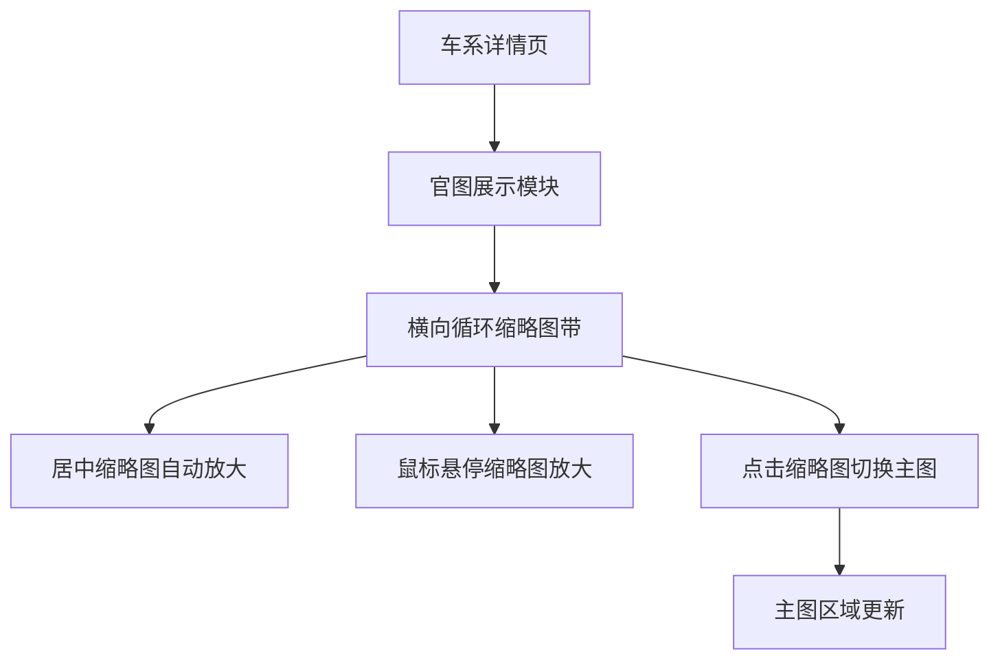

## 1. Product Overview
车系详情页的「官图展示」模块升级为横向循环流动的缩略图形态。
核心目标：让用户在不打断浏览的情况下，更直观、更有动势地浏览官图，并通过“居中自动放大 + 悬停放大”强化焦点。

## 2. Core Features

### 2.1 Feature Module
本次需求涉及以下页面：
1. **车系详情页**：官图展示（主图区域、横向循环缩略图带、居中自动放大、悬停放大、点击切换）。

### 2.2 Page Details
| Page Name | Module Name | Feature description |
|-----------|-------------|---------------------|
| 车系详情页 | 官图展示-主图区域 | 展示当前选中的官图大图；随缩略图点击/选中状态同步刷新。 |
| 车系详情页 | 官图展示-横向循环缩略图带 | 以横向方式持续循环流动展示官图缩略图；缩略图按固定高度等比裁切/填充，保证整齐一致。 |
| 车系详情页 | 官图展示-居中自动放大 | 当某张缩略图移动到缩略图带的视觉中心位置时，自动放大该缩略图（视觉强调“当前焦点”），其余缩略图保持默认大小。 |
| 车系详情页 | 官图展示-鼠标悬停放大 | 鼠标悬停任意缩略图时放大该缩略图（不要求改变当前选中状态）；移出后恢复。 |
| 车系详情页 | 官图展示-交互与状态同步 | 点击任意缩略图：切换主图为该图，并更新选中态；选中态与“居中自动放大”可同时存在（优先保证选中态可识别）。 |
| 车系详情页 | 官图展示-基础可用性 | 缩略图加载失败时展示占位；图片 alt 文案使用车系名+序号（或已有规则）以保证可访问性。 |

## 3. Core Process
**用户浏览官图流程**
1. 你进入车系详情页后，在「官图展示」看到主图与下方横向循环流动的缩略图。
2. 缩略图持续横向循环流动，移动到中心位置的缩略图会自动放大，提示当前视觉焦点。
3. 你将鼠标悬停在任意缩略图上，该缩略图放大以便你更清晰查看。
4. 你点击某个缩略图，主图切换为对应官图，同时该缩略图呈现选中态。

