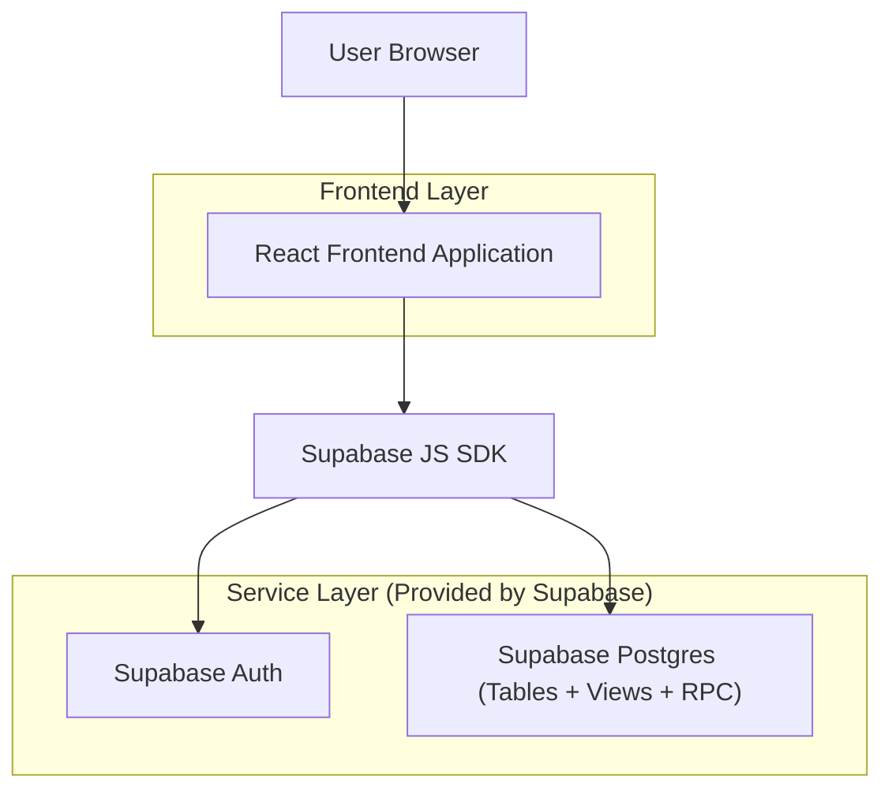
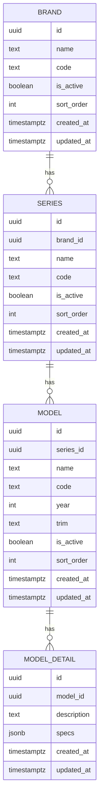

## 1.Architecture design


关键点：
- “本地暂存”在前端内存/本地存储中维护变更集（ChangeSet）。
- “确认后一次性写库”通过 **Supabase RPC（Postgres Function）** 接收变更集，在数据库端开启事务批量应用，确保要么整体成功，要么整体失败（或按策略返回逐条结果）。

## 2.Technology Description
- Frontend: React@18 + TypeScript + vite + tailwindcss@3
- Backend: Supabase（Auth + Postgres + RPC Functions + Views）

## 3.Route definitions
| Route | Purpose |
|-------|---------|
| /login | 管理员登录页 |
| /admin/vehicle-data | 数据管理页（品牌/车系/车型/车型详情四视图 + 本地暂存 + 批量提交） |

## 4.API definitions (If it includes backend services)
（使用 Supabase RPC，前端通过 `supabase.rpc()` 调用）

### 4.1 Core Types (TypeScript)
```ts
export type EntityType = 'brand' | 'series' | 'model' | 'model_detail'
export type ChangeOp = 'insert' | 'update' | 'delete'

export type ChangeItem = {
  entity: EntityType
  op: ChangeOp
  // 新增时可能是前端临时 id；更新/删除通常是数据库 id
  id?: string
  tempId?: string
  // insert/update 时携带字段；delete 可不带
  data?: Record<string, any>
  // 可选：乐观锁（推荐）
  expectedUpdatedAt?: string
}

export type ChangeSet = {
  clientRequestId: string
  createdAt: string
  items: ChangeItem[]
}

export type ApplyResultItem = {
  index: number
  ok: boolean
  entity: EntityType
  op: ChangeOp
  id?: string
  tempId?: string
  errorCode?: string
  errorMessage?: string
}

export type ApplyResult = {
  ok: boolean
  clientRequestId: string
  appliedCount: number
  results: ApplyResultItem[]
}
```

### 4.2 RPC: 批量应用变更
调用：
```ts
supabase.rpc('apply_vehicle_changes', { changes: changeSet })
```

输入：
- `changes: jsonb`（包含 `clientRequestId / items[]` 等）

输出（建议）：
- `jsonb`，结构为 `ApplyResult`

设计建议：
- RPC 内部开启事务；按 `items[]` 顺序执行。
- 若你希望“全部成功才提交”，遇到任一失败则 `RAISE EXCEPTION` 触发回滚。
- 若你希望“部分成功并返回逐条失败原因”，则在函数内部用子事务/异常捕获策略收集错误（实现复杂度更高）。

## 6.Data model(if applicable)

### 6.1 Data model definition


补充：数据库“视图”用于更好展示（例如联表显示 brand_name/series_name），写操作建议直接落到表或通过 RPC 统一处理。

### 6.2 Data Definition Language
> 说明：以下为建议 DDL；实际字段以你现有数据库视图/表结构为准。

基础表
```sql
CREATE TABLE brands (
  id UUID PRIMARY KEY DEFAULT gen_random_uuid(),
  name TEXT NOT NULL,
  code TEXT,
  is_active BOOLEAN NOT NULL DEFAULT TRUE,
  sort_order INT NOT NULL DEFAULT 0,
  created_at TIMESTAMPTZ NOT NULL DEFAULT NOW(),
  updated_at TIMESTAMPTZ NOT NULL DEFAULT NOW()
);

CREATE TABLE series (
  id UUID PRIMARY KEY DEFAULT gen_random_uuid(),
  brand_id UUID NOT NULL,
  name TEXT NOT NULL,
  code TEXT,
  is_active BOOLEAN NOT NULL DEFAULT TRUE,
  sort_order INT NOT NULL DEFAULT 0,
  created_at TIMESTAMPTZ NOT NULL DEFAULT NOW(),
  updated_at TIMESTAMPTZ NOT NULL DEFAULT NOW()
);

CREATE TABLE models (
  id UUID PRIMARY KEY DEFAULT gen_random_uuid(),
  series_id UUID NOT NULL,
  name TEXT NOT NULL,
  code TEXT,
  year INT,
  trim TEXT,
  is_active BOOLEAN NOT NULL DEFAULT TRUE,
  sort_order INT NOT NULL DEFAULT 0,
  created_at TIMESTAMPTZ NOT NULL DEFAULT NOW(),
  updated_at TIMESTAMPTZ NOT NULL DEFAULT NOW()
);

CREATE TABLE model_details (
  id UUID PRIMARY KEY DEFAULT gen_random_uuid(),
  model_id UUID NOT NULL,
  description TEXT,
  specs JSONB NOT NULL DEFAULT '{}'::jsonb,
  created_at TIMESTAMPTZ NOT NULL DEFAULT NOW(),
  updated_at TIMESTAMPTZ NOT NULL DEFAULT NOW()
);
```

视图（用于“查”）
```sql
CREATE VIEW v_series_list AS
SELECT
  s.*, b.name AS brand_name
FROM series s
JOIN brands b ON b.id = s.brand_id;

CREATE VIEW v_model_list AS
SELECT
  m.*, s.name AS series_name, b.name AS brand_name
FROM models m
JOIN series s ON s.id = m.series_id
JOIN brands b ON b.id = s.brand_id;

CREATE VIEW v_model_detail_list AS
SELECT
  d.*, m.name AS model_name, s.name AS series_name, b.name AS brand_name
FROM model_details d
JOIN models m ON m.id = d.model_id
JOIN series s ON s.id = m.series_id
JOIN brands b ON b.id = s.brand_id;
```

RPC：批量提交（示意骨架）
```sql
CREATE OR REPLACE FUNCTION apply_vehicle_changes(changes jsonb)
RETURNS jsonb
LANGUAGE plpgsql
AS $$
DECLARE
  item jsonb;
BEGIN
  -- 建议：校验 changes 结构、items 是否为空、entity/op 是否合法

  -- 全量事务：任一失败则回滚
  FOR item IN SELECT * FROM jsonb_array_elements(changes->'items')
  LOOP
    -- 根据 item->>'entity' & item->>'op' 分发到不同表的 insert/update/delete
    -- insert: 使用 item->'data'
    -- update/delete: 使用 item->>'id'
  END LOOP;

  RETURN jsonb_build_object(
    'ok', true,
    'clientRequestId', changes->>'clientRequestId',
    'appliedCount', jsonb_array_length(changes->'items'),
    'results', '[]'::jsonb
  );
EXCEPTION WHEN OTHERS THEN
  -- 统一错误输出
  RETURN jsonb_build_object(
    'ok', false,
    'clientRequestId', changes->>'clientRequestId',
    'appliedCount', 0,
    'results', jsonb_build_array(
      jsonb_build_object('ok', false, 'errorMessage', SQLERRM)
    )
  );
END;
$$;
```

权限与安全（建议）
```sql
-- 典型授权（仍建议配合 RLS，保证匿名不可读写后台数据）
GRANT SELECT ON v_series_list TO anon;
GRANT SELECT ON v_model_list TO anon;
GRANT SELECT ON v_model_detail_list TO anon;

GRANT ALL PRIVILEGES ON brands TO authenticated;
GRANT ALL PRIVILEGES ON series TO authenticated;
GRANT ALL PRIVILEGES ON models TO authenticated;
GRANT ALL PRIVILEGES ON model_details TO authenticated;

-- 建议开启 RLS，并只允许 authenticated 访问
ALTER TABLE brands ENABLE ROW LEVEL SECURITY;
ALTER TABLE series ENABLE ROW LEVEL SECURITY;
ALTER TABLE models ENABLE ROW LEVEL SECURITY;
ALTER TABLE model_details ENABLE ROW LEVEL SECURITY;

CREATE POLICY "brands_authenticated_all" ON brands FOR ALL TO authenticated USING (true) WITH CHECK (true);
CREATE POLICY "series_authenticated_all" ON series FOR ALL TO authenticated USING (true) WITH CHECK (true);
CREATE POLICY "models_authenticated_all" ON models FOR ALL TO authenticated USING (true) WITH CHECK (true);
CREATE POLICY "model_details_authenticated_all" ON model_details FOR ALL TO authenticated USING (true) WITH CHECK (true);
```

前端本地暂存实现要点
- 维护 `draft.items[]`（新增/修改/删除）并与当前表格行做“脏标记”。
- 支持撤销：从 draft 中删除对应 ChangeItem，并回滚 UI 行数据（可通过原始快照实现）。
- 提交前将新增项的 `tempId` 与提交后返回的真实 `id` 做映射，用于刷新列表与清理草稿。