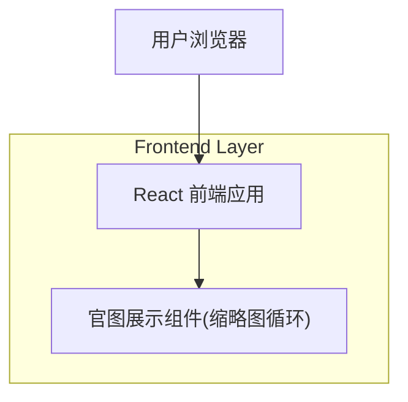

## 1.Architecture design

## 2.Technology Description
- Frontend: React@18 + react-router-dom@7 + tailwindcss@3 + vite
- Backend: None（本需求为纯前端交互与样式升级）
- UI/交互实现建议：Swiper（React 组件）用于“横向循环 + 居中聚焦 + 自动流动”

## 3.Route definitions
| Route | Purpose |
|-------|---------|
| /series/:seriesId | 车系详情页（包含「官图展示」模块） |

## 4.Implementation Plan（前端）

### 4.1 组件拆分建议
- `OfficialGallery`
  - `MainImage`：主图展示
  - `ThumbnailMarquee`：横向循环流动缩略图

### 4.2 关键交互如何落地
**目标交互**
- 横向循环流动：缩略图持续向左（或向右）匀速移动，视觉上“无缝循环”。
- 居中自动放大：处于视窗中心的缩略图放大。
- 悬停放大：鼠标悬停的缩略图放大。
- 点击切换：点击缩略图切换主图。

**推荐方案：Swiper 连续自动滚动 + loop + centeredSlides**
- 使用 `Swiper` 作为缩略图带：
  - `loop: true`
  - `centeredSlides: true`
  - `slidesPerView: 'auto'`（每个缩略图固定宽度，间距一致）
  - `autoplay: { delay: 0, disableOnInteraction: false }`（配合 `speed` 实现连续滚动）
  - `speed: 8000 ~ 15000`（按体验调整，值越大越“慢且匀速”）
- 居中自动放大：用 CSS 针对 `.swiper-slide-active` 做 scale 放大，并加过渡：
  - 默认：`scale(1)`
  - active：`scale(1.18)`（示例）
  - `transition: transform 200ms ease`
- 悬停放大：对 `.swiper-slide:hover` 做 scale 放大（略大于 active 或相当）：
  - hover：`scale(1.22)`（示例）
  - 如果 hover 与 active 冲突：以 hover 为准（CSS 优先级或单独 class 控制）。
- 点击切换主图：
  - `onClick` 时将缩略图对应的图片 id/url 写入组件状态 `selectedImage`，主图跟随渲染。
  - 同时调用 Swiper 的 `slideToLoop(index)`（可选）让被点击项移动到中心，保证“点击后居中强调”。

### 4.3 样式与可用性细节（Tailwind/CSS）
- 容器：`overflow-hidden`，保证只显示一条缩略图带。
- 缩略图：固定高度（如 64/72px），宽度可固定或按比例裁切；建议统一 `object-fit: cover`。
- 选中态：在缩略图上叠加边框/阴影（例如 2px 品牌色描边），确保即使未在中心也能识别。
- 图片加载失败：`onError` 切占位图；避免布局抖动。
- 性能：缩略图使用 `loading="lazy"`；主图可用 `fetchpriority="high"`（若当前实现支持）。

### 4.4 依赖与风险
- 新增依赖：`swiper`（React 版本组件）。
- 风险点：
  1) 连续 autoplay（delay=0）在部分浏览器/低端机可能出现轻微抖动：可通过增大 `speed`、减少阴影/滤镜、降低图片尺寸缓解。
  2) hover 放大会影响相邻间距：建议给缩略图 slide 预留内边距或用 `transform` 只缩放内容层（不改变布局）。
  3) loop 场景点击定位：用 `slideToLoop` 而不是 `slideTo`，避免索引错位。
