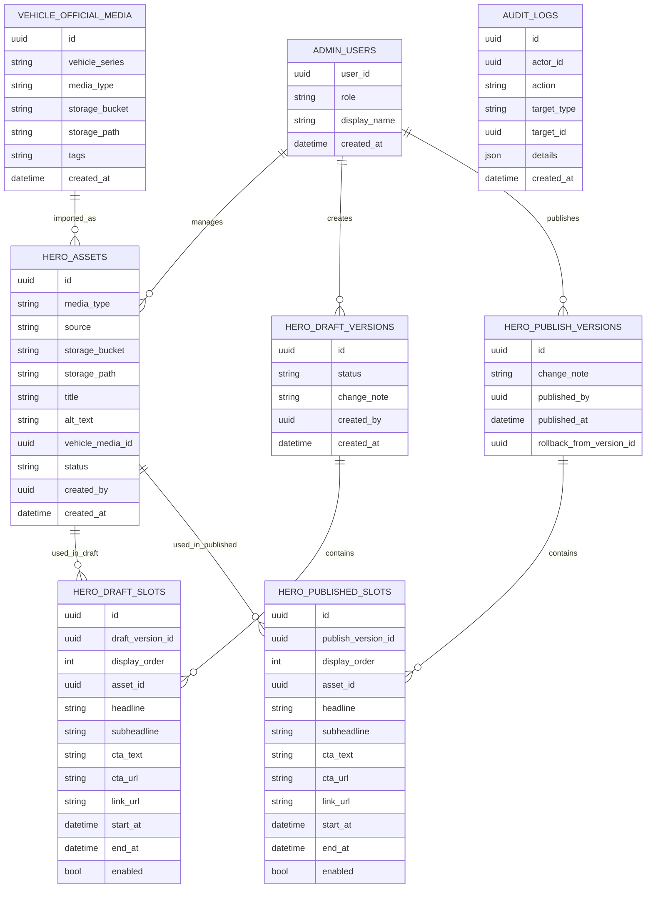

## 1.Architecture design
```mermaid
graph TD
  A["管理员浏览器"] --> B["React 后台管理前端"]
  P["访客浏览器"] --> W["官网前端(首页)"]
  B --> C["Supabase SDK"]
  W --> C
  C --> D["Supabase Auth"]
  C --> E["Supabase Database"]
  C --> F["Supabase Storage"]

  subgraph "Frontend Layer"
    B
    W
  end

  subgraph "Service Layer (Provided by Supabase)"
    D
    E
    F
  end
end
```

## 2.Technology Description
- Frontend（后台管理）：React@18 + vite + tailwindcss@3
- Frontend（官网首页）：React@18（沿用现有栈即可）
- Backend：Supabase（Auth + Postgres + Storage）

## 3.Route definitions
| Route | Purpose |
|---|---|
| /admin/login | 后台登录页 |
| /admin/hero-assets | 英雄区展示素材管理（素材库 + 配置 + 发布） |

## 6.Data model(if applicable)
### 6.1 Data model definition
> 说明：为降低迁移复杂度，外键关系使用“逻辑外键”（字段存 id，不建立物理 FK 约束）。



### 6.2 Data Definition Language
#### 1) 管理后台账号角色表（admin_users）
```sql
CREATE TABLE admin_users (
  user_id UUID PRIMARY KEY,
  role VARCHAR(20) NOT NULL CHECK (role IN ('admin')),
  display_name VARCHAR(50),
  created_at TIMESTAMPTZ DEFAULT NOW()
);
```

#### 2) 英雄区素材表（hero_assets）
```sql
CREATE TABLE hero_assets (
  id UUID PRIMARY KEY DEFAULT gen_random_uuid(),
  media_type VARCHAR(10) NOT NULL CHECK (media_type IN ('image','video')),
  source VARCHAR(10) NOT NULL CHECK (source IN ('upload','official')),
  storage_bucket VARCHAR(50) NOT NULL,
  storage_path TEXT NOT NULL,
  title VARCHAR(80),
  alt_text VARCHAR(120),
  vehicle_media_id UUID,
  status VARCHAR(10) NOT NULL DEFAULT 'draft' CHECK (status IN ('draft','published','disabled')),
  created_by UUID NOT NULL,
  created_at TIMESTAMPTZ DEFAULT NOW()
);
CREATE INDEX idx_hero_assets_created_at ON hero_assets(created_at DESC);
CREATE INDEX idx_hero_assets_status ON hero_assets(status);
```

#### 3) 官图媒体表（vehicle_official_media）（如项目已有同类表，可映射替代）
```sql
CREATE TABLE vehicle_official_media (
  id UUID PRIMARY KEY DEFAULT gen_random_uuid(),
  vehicle_series VARCHAR(80) NOT NULL,
  media_type VARCHAR(10) NOT NULL CHECK (media_type IN ('image','video')),
  storage_bucket VARCHAR(50) NOT NULL,
  storage_path TEXT NOT NULL,
  tags TEXT,
  created_at TIMESTAMPTZ DEFAULT NOW()
);
CREATE INDEX idx_vehicle_official_media_series ON vehicle_official_media(vehicle_series);
```

#### 4) 草稿版本与草稿位（hero_draft_versions / hero_draft_slots）
```sql
CREATE TABLE hero_draft_versions (
  id UUID PRIMARY KEY DEFAULT gen_random_uuid(),
  status VARCHAR(12) NOT NULL DEFAULT 'editing' CHECK (status IN ('editing','archived')),
  change_note TEXT,
  created_by UUID NOT NULL,
  created_at TIMESTAMPTZ DEFAULT NOW()
);

CREATE TABLE hero_draft_slots (
  id UUID PRIMARY KEY DEFAULT gen_random_uuid(),
  draft_version_id UUID NOT NULL,
  display_order INT NOT NULL,
  asset_id UUID NOT NULL,
  headline VARCHAR(60),
  subheadline VARCHAR(120),
  cta_text VARCHAR(20),
  cta_url TEXT,
  link_url TEXT,
  start_at TIMESTAMPTZ,
  end_at TIMESTAMPTZ,
  enabled BOOLEAN NOT NULL DEFAULT TRUE
);
CREATE INDEX idx_hero_draft_slots_version_order ON hero_draft_slots(draft_version_id, display_order);
```

#### 5) 已发布版本与线上位（hero_publish_versions / hero_published_slots）
```sql
CREATE TABLE hero_publish_versions (
  id UUID PRIMARY KEY DEFAULT gen_random_uuid(),
  change_note TEXT,
  published_by UUID NOT NULL,
  published_at TIMESTAMPTZ DEFAULT NOW(),
  rollback_from_version_id UUID
);

CREATE TABLE hero_published_slots (
  id UUID PRIMARY KEY DEFAULT gen_random_uuid(),
  publish_version_id UUID NOT NULL,
  display_order INT NOT NULL,
  asset_id UUID NOT NULL,
  headline VARCHAR(60),
  subheadline VARCHAR(120),
  cta_text VARCHAR(20),
  cta_url TEXT,
  link_url TEXT,
  start_at TIMESTAMPTZ,
  end_at TIMESTAMPTZ,
  enabled BOOLEAN NOT NULL DEFAULT TRUE
);
CREATE INDEX idx_hero_published_slots_version_order ON hero_published_slots(publish_version_id, display_order);
```

#### 6) 当前线上版本指针（hero_runtime_state）
```sql
CREATE TABLE hero_runtime_state (
  id INT PRIMARY KEY DEFAULT 1,
  current_publish_version_id UUID NOT NULL,
  updated_at TIMESTAMPTZ DEFAULT NOW()
);
INSERT INTO hero_runtime_state (id, current_publish_version_id)
VALUES (1, '00000000-0000-0000-0000-000000000000')
ON CONFLICT (id) DO NOTHING;
```

#### 7) 审计日志（audit_logs）
```sql
CREATE TABLE audit_logs (
  id UUID PRIMARY KEY DEFAULT gen_random_uuid(),
  actor_id UUID NOT NULL,
  action VARCHAR(30) NOT NULL,
  target_type VARCHAR(30) NOT NULL,
  target_id UUID,
  details JSONB,
  created_at TIMESTAMPTZ DEFAULT NOW()
);
CREATE INDEX idx_audit_logs_created_at ON audit_logs(created_at DESC);
```

## 7. 权限与发布生效（关键说明）
### 7.1 RLS 权限策略（原则）
- 所有后台写操作必须为 authenticated 且在 admin_users 中具备相应 role。
- 官网首页仅需要读取“线上位 + 素材信息”，建议通过 View 暴露给 anon。

建议视图（供官网读取）：
- hero_public_slots_view：从 hero_runtime_state.current_publish_version_id 关联 hero_published_slots + hero_assets，过滤 enabled 且排期生效。

### 7.2 授权建议（符合 Supabase 角色原则）
```sql
-- 官网读取：给 anon 基础 SELECT（通常配合 View + RLS 更安全）
GRANT SELECT ON hero_published_slots TO anon;
GRANT SELECT ON hero_assets TO anon;

-- 后台：给 authenticated 完整权限（实际仍建议配合 RLS 限制到 admin_users）
GRANT ALL PRIVILEGES ON hero_assets TO authenticated;
GRANT ALL PRIVILEGES ON hero_draft_versions TO authenticated;
GRANT ALL PRIVILEGES ON hero_draft_slots TO authenticated;
GRANT ALL PRIVILEGES ON hero_publish_versions TO authenticated;
GRANT ALL PRIVILEGES ON hero_published_slots TO authenticated;
GRANT ALL PRIVILEGES ON hero_runtime_state TO authenticated;
GRANT ALL PRIVILEGES ON audit_logs TO authenticated;
```

### 7.3 Storage 权限（建议）
- Bucket：hero-draft（私有，仅 editor/publisher/admin 可读写）；hero-public（公开读，只有 publisher/admin 可写）。
- 发布动作：publisher 在发布时将草稿配置写入 hero_publish_versions/hero_published_slots，并确保所用素材文件已存在于 hero-public（若素材来自上传且仅在 hero-draft，可在发布时复制到 hero-public）。

### 7.4 发布生效流程（数据层）
1) editor 在 hero_draft_versions( editing ) 下编辑 hero_draft_slots。
2) 提交后将版本置为 pending_review，并冻结关键字段。
3) publisher 审核通过后：
   - 生成 hero_publish_versions 记录
   - 将草稿位复制写入 hero_published_slots（publish_version_id=新版本）
   - 更新 hero_runtime_state.current_publish_version_id=新版本（即刻生效）
4) 回滚：创建新的 hero_publish_versions（rollback_from_version_id=目标版本），并将目标版本 slots 复制为新版本，然后更新 hero_runtime_state 指针。
