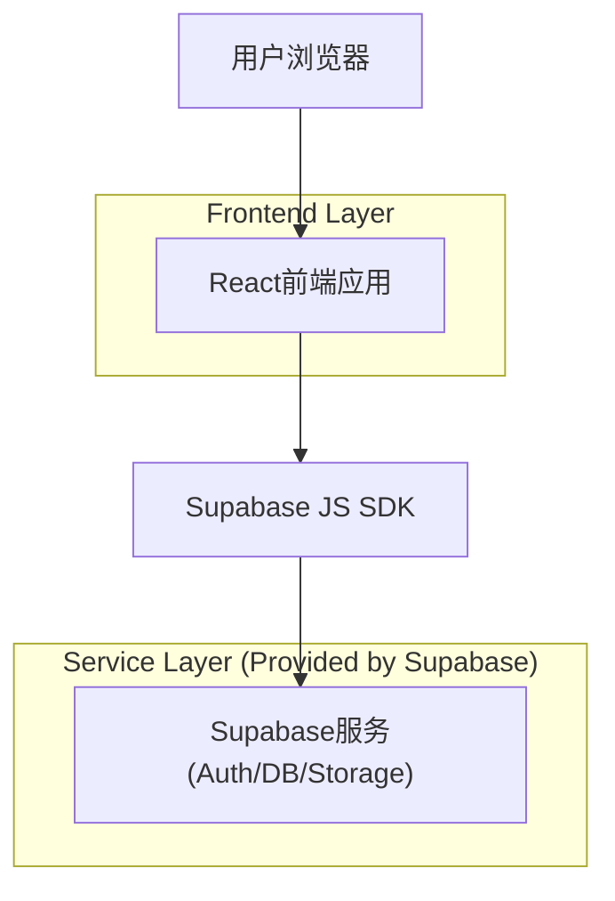
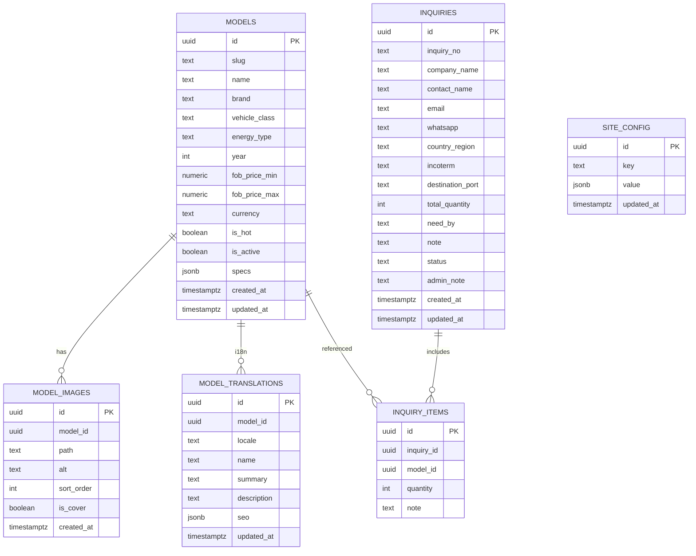

## 1.Architecture design


## 2.Technology Description
- Frontend: React@18 + vite + TypeScript + tailwindcss@3
- Backend: Supabase（Auth + PostgreSQL + Storage + RLS）

国际化与RTL
- i18n：使用 i18next + react-i18next，路由前缀采用 `/:locale/*`。
- 支持语言（locale code）：
  - `zh-CN` 中文（简体） LTR
  - `en` English LTR
  - `ru` Русский LTR
  - `ar` العربية RTL
  - `th` ไทย LTR
  - `lo` ລາວ LTR
  - `fa` فارسی RTL
  - `tr` Türkçe LTR
  - `ckb` کوردی RTL（库尔德语，优先Sorani以覆盖RTL场景）
  - `uz` Oʻzbekcha LTR
  - `kk` Қазақша LTR
  - `ky` Кыргызча LTR
  - `tg` Тоҷикӣ LTR
  - `tk` Türkmençe LTR
  - `ps` پښتو RTL
  - `ur` اردو RTL
  - `he` עברית RTL
  - `hy` Հայերեն LTR
  - `ka` ქართული LTR
- RTL 切换：前端根据 locale 设置 `document.documentElement.dir` 与 `lang`。

## 3.Route definitions
| Route | Purpose |
|-------|---------|
| / | 自动重定向到默认语言（如 /en） |
| /:locale | 首页：品牌展示、热销推荐、询盘入口 |
| /:locale/models | 热销车型库：筛选、搜索、列表展示 |
| /:locale/models/:slug | 车型详情：参数、图片、询盘CTA |
| /:locale/inquiry | 询盘提交：结构化表单与提交确认 |
| /:locale/admin | 管理后台入口：登录后进行车型/询盘/配置管理 |

## 6.Data model(if applicable)

### 6.1 Data model definition


### 6.2 Data Definition Language
Models（models）
```sql
CREATE TABLE IF NOT EXISTS models (
  id uuid PRIMARY KEY DEFAULT gen_random_uuid(),
  slug text UNIQUE,
  name text NOT NULL,
  brand text,
  vehicle_class text,
  energy_type text,
  year int,
  fob_price_min numeric,
  fob_price_max numeric,
  currency text DEFAULT 'USD',
  is_hot boolean DEFAULT false,
  is_active boolean DEFAULT true,
  specs jsonb DEFAULT '{}'::jsonb,
  created_at timestamptz DEFAULT now(),
  updated_at timestamptz DEFAULT now()
);

CREATE INDEX IF NOT EXISTS idx_models_hot_active ON models(is_hot, is_active);
CREATE INDEX IF NOT EXISTS idx_models_brand ON models(brand);
CREATE INDEX IF NOT EXISTS idx_models_energy_type ON models(energy_type);
```

Model images（model_images）
```sql
CREATE TABLE IF NOT EXISTS model_images (
  id uuid PRIMARY KEY DEFAULT gen_random_uuid(),
  model_id uuid NOT NULL,
  path text NOT NULL,
  alt text,
  sort_order int DEFAULT 0,
  is_cover boolean DEFAULT false,
  created_at timestamptz DEFAULT now()
);

CREATE INDEX IF NOT EXISTS idx_model_images_model_id ON model_images(model_id);
```

Model translations（model_translations）
```sql
CREATE TABLE IF NOT EXISTS model_translations (
  id uuid PRIMARY KEY DEFAULT gen_random_uuid(),
  model_id uuid NOT NULL,
  locale text NOT NULL,
  name text NOT NULL,
  summary text,
  description text,
  seo jsonb DEFAULT '{}'::jsonb,
  updated_at timestamptz DEFAULT now(),
  UNIQUE (model_id, locale)
);

CREATE INDEX IF NOT EXISTS idx_model_translations_model_id ON model_translations(model_id);
CREATE INDEX IF NOT EXISTS idx_model_translations_locale ON model_translations(locale);
```

Inquiries（inquiries）
```sql
CREATE TABLE IF NOT EXISTS inquiries (
  id uuid PRIMARY KEY DEFAULT gen_random_uuid(),
  inquiry_no text UNIQUE NOT NULL,
  company_name text NOT NULL,
  contact_name text NOT NULL,
  email text NOT NULL,
  whatsapp text,
  country_region text,
  incoterm text,
  destination_port text,
  total_quantity int,
  need_by text,
  note text,
  status text DEFAULT 'new' CHECK (status IN ('new','contacted','quoting','won','lost')),
  admin_note text,
  created_at timestamptz DEFAULT now(),
  updated_at timestamptz DEFAULT now()
);

CREATE INDEX IF NOT EXISTS idx_inquiries_created_at ON inquiries(created_at DESC);
CREATE INDEX IF NOT EXISTS idx_inquiries_status ON inquiries(status);
```

Inquiry items（inquiry_items）
```sql
CREATE TABLE IF NOT EXISTS inquiry_items (
  id uuid PRIMARY KEY DEFAULT gen_random_uuid(),
  inquiry_id uuid NOT NULL,
  model_id uuid,
  quantity int,
  note text
);

CREATE INDEX IF NOT EXISTS idx_inquiry_items_inquiry_id ON inquiry_items(inquiry_id);
CREATE INDEX IF NOT EXISTS idx_inquiry_items_model_id ON inquiry_items(model_id);
```

Site config（site_config）
```sql
CREATE TABLE IF NOT EXISTS site_config (
  id uuid PRIMARY KEY DEFAULT gen_random_uuid(),
  key text UNIQUE NOT NULL,
  value jsonb DEFAULT '{}'::jsonb,
  updated_at timestamptz DEFAULT now()
);
```

权限与RLS策略（建议）
```sql
-- 基础授权（按 Supabase 建议：anon 只读公开数据，authenticated 全量）
GRANT SELECT ON models TO anon;
GRANT SELECT ON model_images TO anon;
GRANT INSERT ON inquiries TO anon;
GRANT INSERT ON inquiry_items TO anon;
GRANT SELECT ON site_config TO anon;

GRANT ALL PRIVILEGES ON models TO authenticated;
GRANT ALL PRIVILEGES ON model_images TO authenticated;
GRANT ALL PRIVILEGES ON inquiries TO authenticated;
GRANT ALL PRIVILEGES ON inquiry_items TO authenticated;
GRANT ALL PRIVILEGES ON site_config TO authenticated;

-- 启用RLS
ALTER TABLE models ENABLE ROW LEVEL SECURITY;
ALTER TABLE model_images ENABLE ROW LEVEL SECURITY;
ALTER TABLE inquiries ENABLE ROW LEVEL SECURITY;
ALTER TABLE inquiry_items ENABLE ROW LEVEL SECURITY;
ALTER TABLE site_config ENABLE ROW LEVEL SECURITY;

-- models：匿名可读(仅上架)，管理员全量
CREATE POLICY "models_select_active_for_anon" ON models
FOR SELECT TO anon
USING (is_active = true);

CREATE POLICY "models_all_for_admin" ON models
FOR ALL TO authenticated
USING (true)
WITH CHECK (true);

-- model_images：匿名可读(图片依附的车型必须上架)，管理员全量
CREATE POLICY "model_images_select_for_anon" ON model_images
FOR SELECT TO anon
USING (
  EXISTS (
    SELECT 1 FROM models m
    WHERE m.id = model_images.model_id AND m.is_active = true
  )
);

CREATE POLICY "model_images_all_for_admin" ON model_images
FOR ALL TO authenticated
USING (true)
WITH CHECK (true);

-- model_translations：匿名可读(翻译依附的车型必须上架)，管理员全量
GRANT SELECT ON model_translations TO anon;
GRANT ALL PRIVILEGES ON model_translations TO authenticated;

ALTER TABLE model_translations ENABLE ROW LEVEL SECURITY;

CREATE POLICY "model_translations_select_for_anon" ON model_translations
FOR SELECT TO anon
USING (
  EXISTS (
    SELECT 1 FROM models m
    WHERE m.id = model_translations.model_id AND m.is_active = true
  )
);

CREATE POLICY "model_translations_all_for_admin" ON model_translations
FOR ALL TO authenticated
USING (true)
WITH CHECK (true);

-- inquiries：匿名仅允许插入；管理员可读写
CREATE POLICY "inquiries_insert_for_anon" ON inquiries
FOR INSERT TO anon
WITH CHECK (true);

CREATE POLICY "inquiries_all_for_admin" ON inquiries
FOR ALL TO authenticated
USING (true)
WITH CHECK (true);

-- inquiry_items：匿名仅允许插入；管理员可读写
CREATE POLICY "inquiry_items_insert_for_anon" ON inquiry_items
FOR INSERT TO anon
WITH CHECK (true);

CREATE POLICY "inquiry_items_all_for_admin" ON inquiry_items
FOR ALL TO authenticated
USING (true)
WITH CHECK (true);

-- site_config：匿名只读；管理员可写
CREATE POLICY "site_config_select_for_anon" ON site_config
FOR SELECT TO anon
USING (true);

CREATE POLICY "site_config_all_for_admin" ON site_config
FOR ALL TO authenticated
USING (true)
WITH CHECK (true);
```

Storage（车型图片）策略建议
- Bucket：`model-assets`（公开读取）
- 前台展示：直接使用公开URL（或经Supabase签名URL视你的公开策略而定）
- 上传/删除：仅 `authenticated`（管理员）允许
- 路径约定：`models/{model_id}/{filename}`，便于按车型清理
