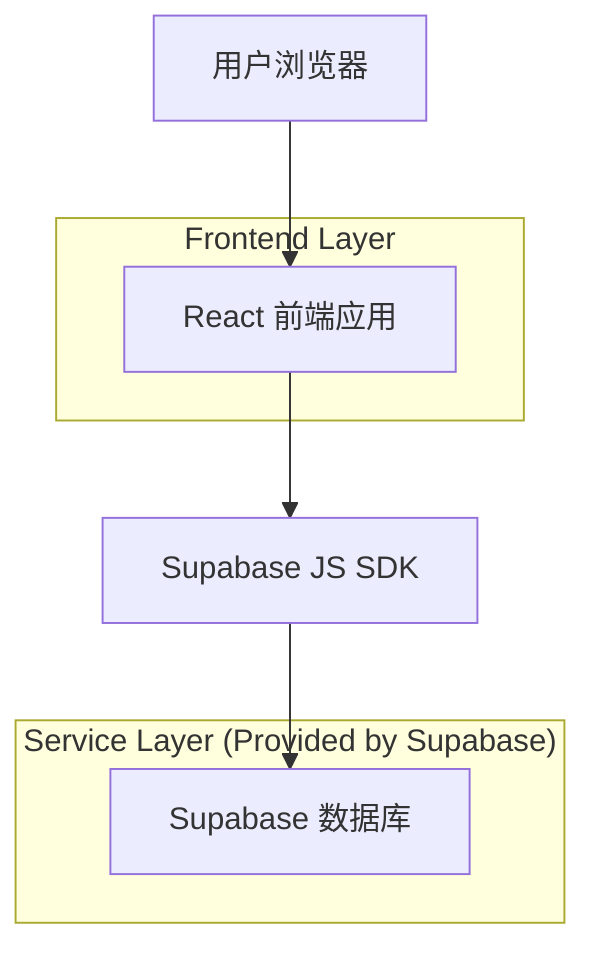
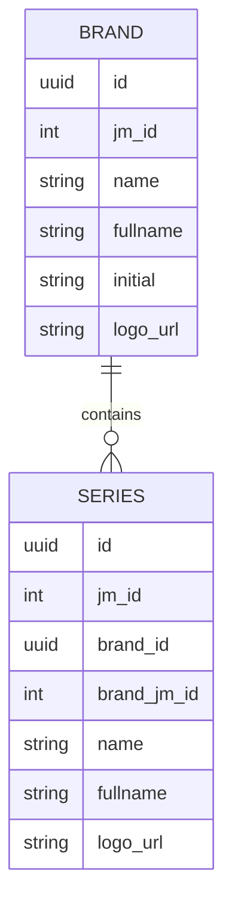

## 1.Architecture design

## 2.Technology Description
- Frontend: React@18 + TypeScript + react-router-dom + tailwindcss + vite
- Backend: Supabase（数据库读取、资源配置读取；本次仅做品牌页 UI/交互改版，数据来源沿用现有）

## 3.Route definitions
| Route | Purpose |
|---|---|
| /:locale/brands | 品牌页（全新视觉；官方图轮播；点击跳转车系） |
| /:locale/series/:id | 车系详情页（承接跳转） |

## 6.Data model(if applicable)
### 6.1 Data model definition

### 6.2 Data Definition Language
> 本次为前端 UI 改版需求，不新增表结构；轮播所需的“官方图”来自现有资源配置数据（沿用既有表/字段）。
