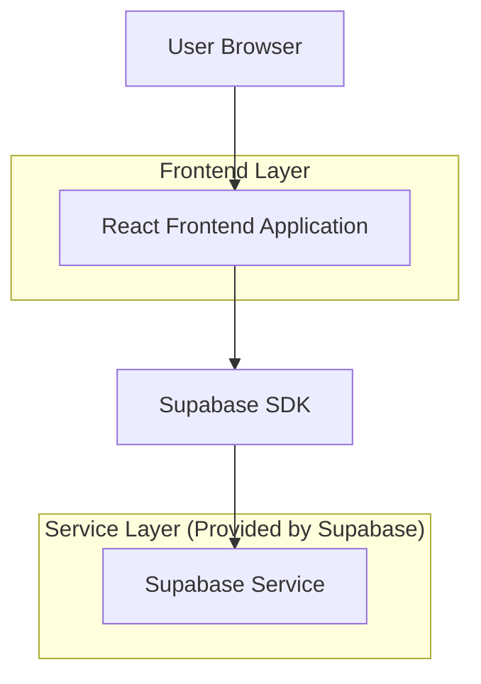

## 1.Architecture design

## 2.Technology Description
- Frontend: React@18 + vite + TypeScript
- Backend: Supabase（Database + Storage，经由 Supabase SDK 直接访问）

## 3.Route definitions
| Route | Purpose |
|-------|---------|
| /brand/:brandId | 品牌页：展示品牌信息与轮播（每个品牌随机官方图、品牌+车系文案、点击跳转） |
| /series/:seriesId/images | 车系详情图页面：展示该车系详情图内容，作为轮播点击的落地页 |

## 6.Data model(if applicable)
- 本需求依赖“品牌、车系、官方图资源”三类数据。
- 若现有数据结构已包含：品牌列表、车系列表、车系官方图（或车系图片集），则无需新增表；仅需在品牌页聚合查询并在前端完成“随机抽取一张官方图”的逻辑。
- 若需要补齐字段，建议最小化新增：为车系图片资源增加 `is_official`（或等价标记）以区分官方图池，前端只从官方图池内抽取。
