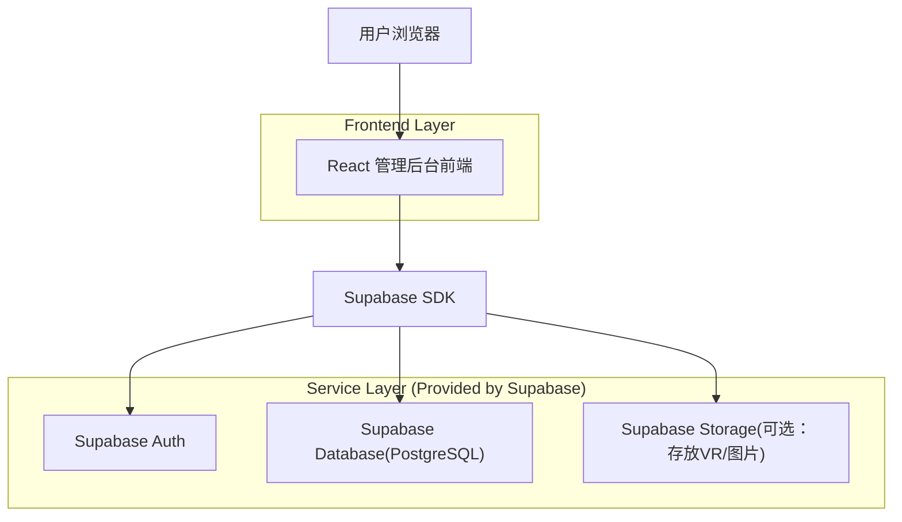
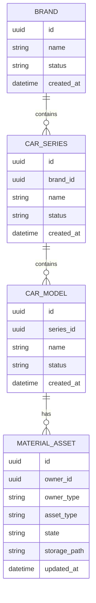

## 1.Architecture design


## 2.Technology Description
- Frontend: React@18 + TypeScript + vite + tailwindcss@3
- Backend: Supabase（Auth + Database；Storage 仅在物料文件需要托管时使用）

## 3.Route definitions
| Route | Purpose |
|-------|---------|
| /admin/material-assets/overview | 数据总览页：品牌→车系→车型树形/思维导图 + 节点物料状态栏 |

## 4.API definitions

说明：优先使用 Supabase 直连（前端通过 RLS 控制权限）；批量操作在前端合并为少量请求。

### 4.1 读取
- brands + series + models：按需分页/懒加载。
- material_assets：按 owner_id + owner_type 批量拉取。

### 4.2 写入（状态修改）
- 单条：更新 material_assets.state 或 brands/car_series/car_models.status。
- 批量：使用 `upsert`/`update ... in (...)` 方式；单次限制（例如 200 条）防止超时。

### 4.3 删除（图组）
- 删除策略：
  1) 先从 Storage 删除文件（如存在 storage_path）。
  2) 再删除 material_assets 记录（或将 state 置为 missing 并清空 storage_path）。
- 批量删除：按 asset_type + owner_type + owner_id 批量执行。

## 5.Security & RLS
- `brands/car_series/car_models/material_assets` 对 anon 仅 SELECT（如前台需要）；对 authenticated 允许写入（后台账号）。
- 建议将后台账号与普通 authenticated 区分（例如 admin_users 表校验），并在 RLS 中限制写权限到管理员。
- 删除 Storage 文件必须保证前端使用的 key 权限足够；若前端无法直接删除，则通过服务端（Edge Function / Server）使用 service_role 执行删除。

## 6.Data model(if applicable)

### 6.1 Data model definition


说明（面向数据总览计算的最小字段约定）：
- owner_type: brand | series | model（资产挂载层级）
- asset_type: exterior_vr | interior_vr | official_images | exterior_images | interior_images | spec_params
- state: present | missing | unknown（用于直接展示；品牌/车系也可通过子级汇总计算得到）

节点状态字段约定：
- brands.status / car_series.status / car_models.status：active(正常) | hidden(不显示) | disabled(不可用)

### 6.2 Data Definition Language
Brand（brands）
```sql
CREATE TABLE brands (
  id UUID PRIMARY KEY DEFAULT gen_random_uuid(),
  name TEXT NOT NULL,
  status TEXT DEFAULT 'active' CHECK (status IN ('active','hidden','disabled')),
  created_at TIMESTAMPTZ DEFAULT NOW()
);

GRANT SELECT ON brands TO anon;
GRANT ALL PRIVILEGES ON brands TO authenticated;
```

Car Series（car_series）
```sql
CREATE TABLE car_series (
  id UUID PRIMARY KEY DEFAULT gen_random_uuid(),
  brand_id UUID NOT NULL,
  name TEXT NOT NULL,
  status TEXT DEFAULT 'active' CHECK (status IN ('active','hidden','disabled')),
  created_at TIMESTAMPTZ DEFAULT NOW()
);

CREATE INDEX idx_car_series_brand_id ON car_series(brand_id);

GRANT SELECT ON car_series TO anon;
GRANT ALL PRIVILEGES ON car_series TO authenticated;
```

Car Model（car_models）
```sql
CREATE TABLE car_models (
  id UUID PRIMARY KEY DEFAULT gen_random_uuid(),
  series_id UUID NOT NULL,
  name TEXT NOT NULL,
  status TEXT DEFAULT 'active' CHECK (status IN ('active','hidden','disabled')),
  created_at TIMESTAMPTZ DEFAULT NOW()
);

CREATE INDEX idx_car_models_series_id ON car_models(series_id);

GRANT SELECT ON car_models TO anon;
GRANT ALL PRIVILEGES ON car_models TO authenticated;
```

Material Asset（material_assets）
```sql
CREATE TABLE material_assets (
  id UUID PRIMARY KEY DEFAULT gen_random_uuid(),
  owner_id UUID NOT NULL,
  owner_type TEXT NOT NULL CHECK (owner_type IN ('brand','series','model')),
  asset_type TEXT NOT NULL CHECK (asset_type IN (
    'exterior_vr','interior_vr','official_images','exterior_images','interior_images','spec_params'
  )),
  state TEXT NOT NULL DEFAULT 'unknown' CHECK (state IN ('present','missing','unknown')),
  storage_path TEXT,
  updated_at TIMESTAMPTZ DEFAULT NOW()
);

CREATE INDEX idx_material_assets_owner ON material_assets(owner_type, owner_id);
CREATE INDEX idx_material_assets_asset_type ON material_assets(asset_type);

GRANT SELECT ON material_assets TO anon;
GR
