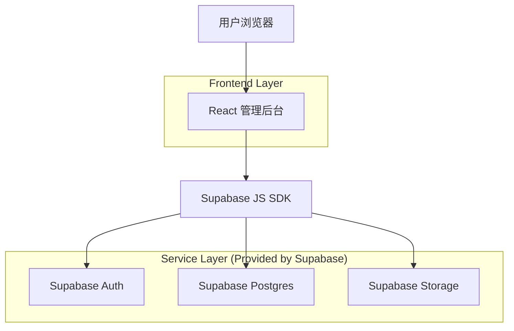
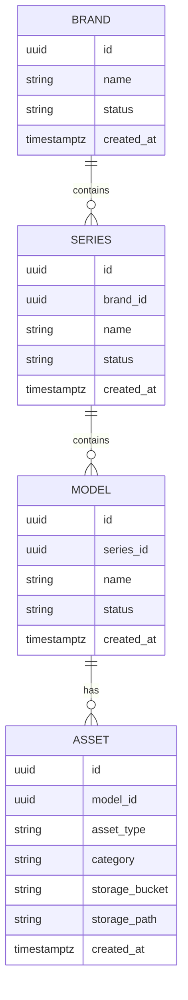

## 1.Architecture design


## 2.Technology Description
- Frontend: React@18 + TypeScript + vite + tailwindcss@3
- Backend: Supabase（Auth + Postgres + Storage）

## 3.Route definitions
| Route | Purpose |
|-------|---------|
| /login | 后台登录（Supabase Auth） |
| /admin/resource/overview | 资源配置“总览表”页面：聚合统计与行内删除 |

## 6.Data model(if applicable)

### 6.1 Data model definition
说明：若现有数据表已覆盖同等语义，可直接映射复用；本处定义为“满足本需求的最小数据语义”。



聚合视图（推荐）：resource_overview_view
- 维度：brand_id + series_id
- 指标：model_count、vr_count、image_count
- 分类统计：按 ASSET.category 聚合（可用 jsonb 对象承载 category->count）

### 6.2 Data Definition Language
```sql
-- 资源表（如已有同等表结构可跳过创建，仅需确保字段可满足查询与删除）
CREATE TABLE IF NOT EXISTS assets (
  id UUID PRIMARY KEY DEFAULT gen_random_uuid(),
  model_id UUID NOT NULL,
  asset_type VARCHAR(10) NOT NULL CHECK (asset_type IN ('vr','image')),
  category VARCHAR(50),
  storage_bucket VARCHAR(100) NOT NULL,
  storage_path TEXT NOT NULL,
  created_at TIMESTAMPTZ DEFAULT NOW()
);

CREATE INDEX IF NOT EXISTS idx_assets_model_id ON assets(model_id);
CREATE INDEX IF NOT EXISTS idx_assets_type ON assets(asset_type);
CREATE INDEX IF NOT EXISTS idx_assets_category ON assets(category);

-- 聚合视图：品牌/车系维度
-- 说明：brands/series/models 表名按你的现有库调整。
CREATE OR REPLACE VIEW resource_overview_view AS
SELECT
  b.id AS brand_id,
  b.name AS brand_name,
  s.id AS series_id,
  s.name AS series_name,
  COUNT(DISTINCT m.id) AS model_count,
  COUNT(a.id) FILTER (WHERE a.asset_type = 'vr') AS vr_count,
  COUNT(a.id) FILTER (WHERE a.asset_type = 'image') AS image_count,
  jsonb_object_agg(COALESCE(a.category, '未分类'), cnt) FILTER (WHERE a.asset_type = 'image') AS image_category_stats
FROM brands b
JOIN series s ON s.brand_id = b.id
LEFT JOIN models m ON m.series_id = s.id
LEFT JOIN LATERAL (
  SELECT category, COUNT(*) AS cnt
  FROM assets a2
  WHERE a2.model_id = m.id AND a2.asset_type = 'image'
  GROUP BY category
) cat ON TRUE
LEFT JOIN assets a ON a.model_id = m.id
GROUP BY b.id, b.name, s.id, s.name;

-- 权限建议（按 Supabase Guideline）
GRANT SELECT ON resource_overview_view TO anon;
GRANT ALL PRIVILEGES ON assets TO authenticated;
-- 如果不希望 anon 可读，可移除上一行并用 RLS 控制。
```

关键交互实现（无自建后端）：
- 查询总览：前端使用 `supabase.from('resource_overview_view').select('*')`，结合品牌/车系筛选条件。
- 删除资源：
  1) 删除数据库记录：`supabase.from('assets').delete().eq('id', assetId)`
  2) 删除对象存储：`supabase.storage.from(bucket).remove([storage_path])`

安全与权限要点：
- 通过 Supabase Auth 限制仅后台登录用户访问 /admin 路由。
- assets 表建议开启 RLS，并仅允许具备后台角色的 authenticated 用户执行 DELETE（具体角色字段/策略按你现有用户模型落地）。
- Storage bucket 配置为私有（private），并通过 policy 限制删除权限仅后台角色可用。
