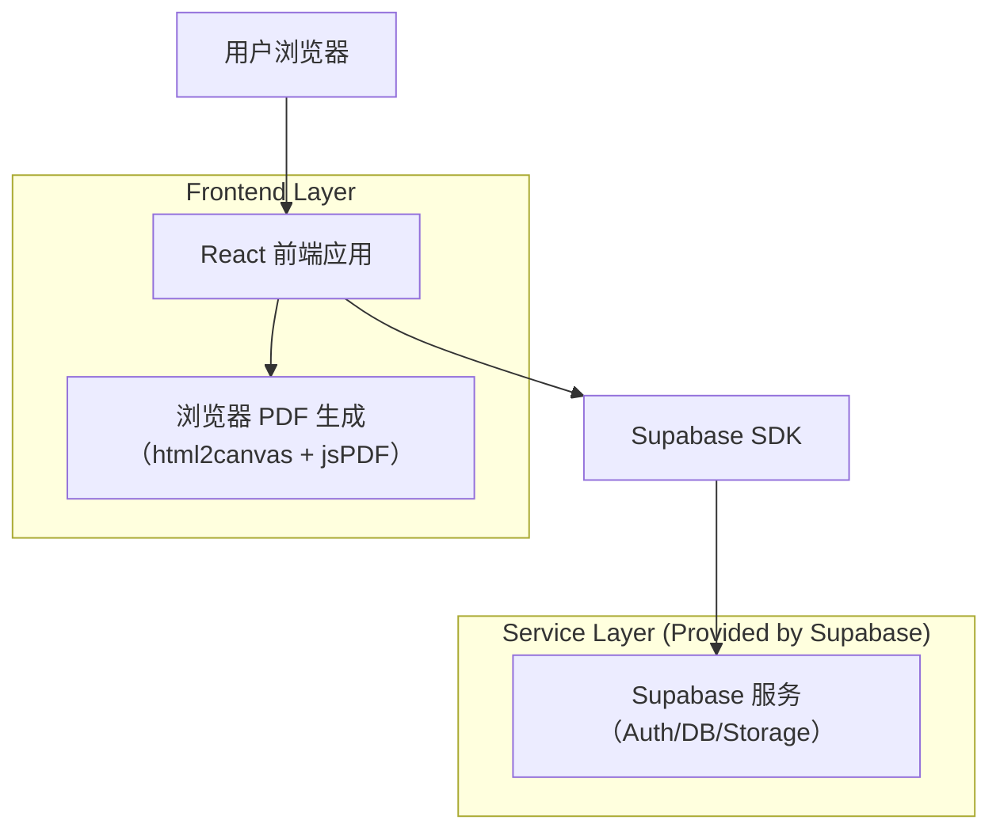
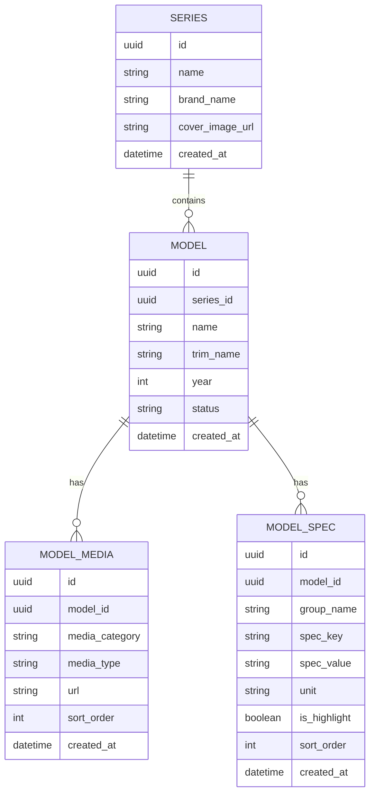

## 1.Architecture design


## 2.Technology Description
- Frontend: React@18 + react-router-dom + tailwindcss@3 + vite
- Backend: Supabase（PostgreSQL + Storage）
- PDF导出: html2canvas + jsPDF（纯前端生成与下载）
- 媒体展示:
  - 360：图片序列/精灵图 + Canvas/DOM（前端实现）
  - 内饰VR：全景图渲染（可选轻量全景查看库，或自研基于 Canvas/WebGL）

## 3.Route definitions
| Route | Purpose |
|-------|---------|
| /series/:seriesId | 车系详情页：展示车型卡片并打开车型详情（弹窗或跳转） |
| /models/:modelId | 车型详情页：360/内饰VR、官方图/实拍图、参数与导出PDF |

## 6.Data model(if applicable)

### 6.1 Data model definition


说明（逻辑外键，不强制物理外键）：
- model.series_id 对应 series.id
- media_category: official | real | exterior360 | interior_vr
- media_type: image | panorama | sprite | sequence（以实际实现为准）
- is_highlight=true 的参数用于“重点参数区”

### 6.2 Data Definition Language
Series 表（series）
```
CREATE TABLE series (
  id UUID PRIMARY KEY DEFAULT gen_random_uuid(),
  name TEXT NOT NULL,
  brand_name TEXT,
  cover_image_url TEXT,
  created_at TIMESTAMPTZ DEFAULT NOW()
);

GRANT SELECT ON series TO anon;
GRANT ALL PRIVILEGES ON series TO authenticated;
```

Model 表（models）
```
CREATE TABLE models (
  id UUID PRIMARY KEY DEFAULT gen_random_uuid(),
  series_id UUID NOT NULL,
  name TEXT NOT NULL,
  trim_name TEXT,
  year INT,
  status TEXT DEFAULT 'published',
  created_at TIMESTAMPTZ DEFAULT NOW()
);

CREATE INDEX idx_models_series_id ON models(series_id);

GRANT SELECT ON models TO anon;
GRANT ALL PRIVILEGES ON models TO authenticated;
```

Model Media 表（model_media）
```
CREATE TABLE model_media (
  id UUID PRIMARY KEY DEFAULT gen_random_uuid(),
  model_id UUID NOT NULL,
  media_category TEXT NOT NULL,
  media_type TEXT NOT NULL,
  url TEXT NOT NULL,
  sort_order INT DEFAULT 0,
  created_at TIMESTAMPTZ DEFAULT NOW()
);

CREATE INDEX idx_model_media_model_id ON model_media(model_id);
CREATE INDEX idx_model_media_category ON model_media(media_category);

GRANT SELECT ON model_media TO anon;
GRANT ALL PRIVILEGES ON model_media TO authenticated;
```

Model Spec 表（model_spec）
```
CREATE TABLE model_spec (
  id UUID PRIMARY KEY DEFAULT gen_random_uuid(),
  model_id UUID NOT NULL,
  group_name TEXT,
  spec_key TEXT NOT NULL,
  spec_value TEXT,
  unit TEXT,
  is_highlight BOOLEAN DEFAULT FALSE,
  sort_order INT DEFAULT 0,
  created_at TIMESTAMPTZ DEFAULT NOW()
);

CREATE INDEX idx_model_spec_model_id ON model_spec(model_id);
CREATE INDEX idx_model_spec_highlight ON model_spec(is_highlight);

GRANT SELECT ON model_spec TO anon;
GRANT ALL