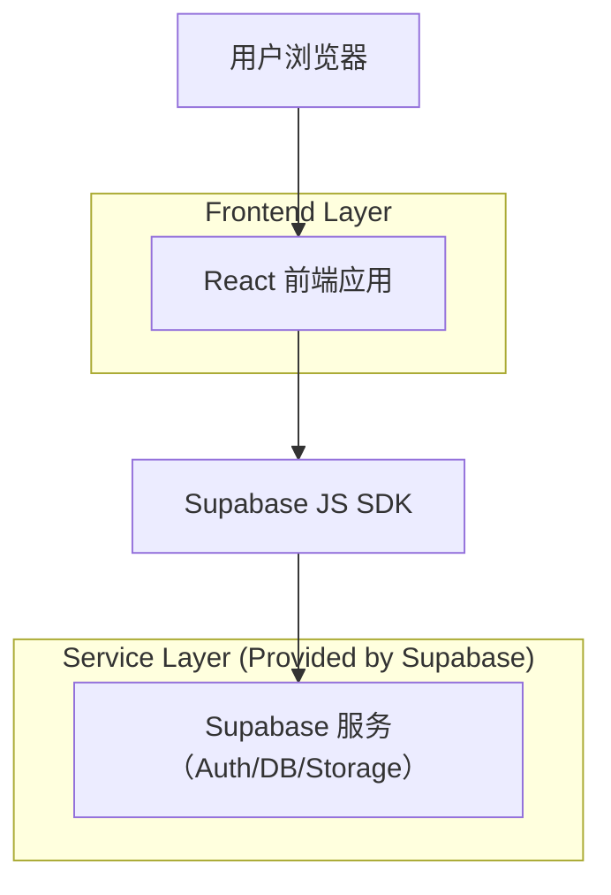
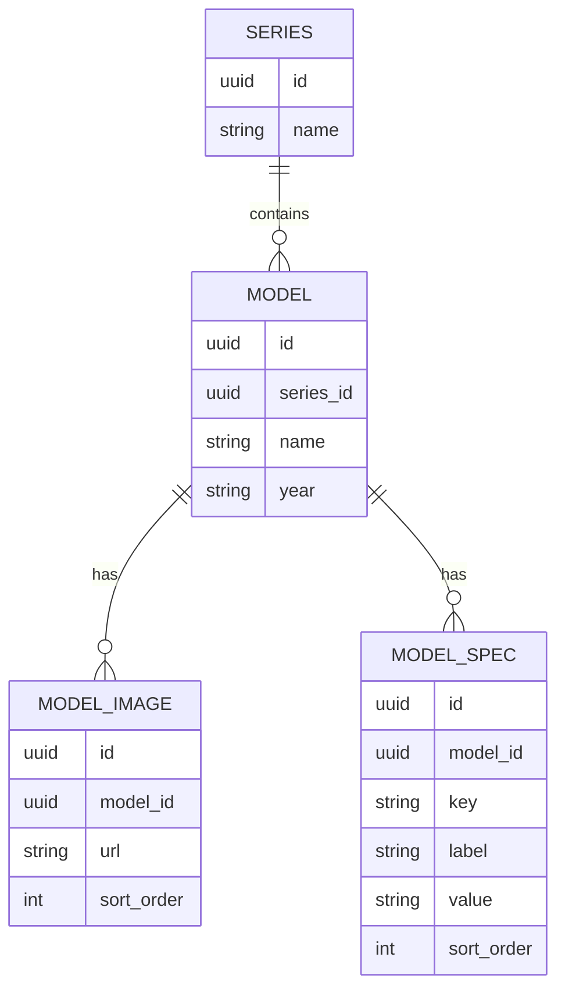

## 1.Architecture design


## 2.Technology Description
- Frontend: React@18 + TypeScript + tailwindcss@3 + vite
- Backend: Supabase（PostgreSQL + Storage）

## 3.Route definitions
| Route | Purpose |
|---|---|
| /series/:seriesId | 车系详情页，承接车系内车型入口（跳转到车型详情页） |
| /models/:modelId | 车型详情页（重构）：左侧同车系车型切换；中间图片；右侧≤12项参数对比；取消 VR 展示 |

## 6.Data model(if applicable)
### 6.1 Data model definition
> 说明：以下为支撑“同车系车型列表 + 图片展示 + 参数对比”的最小数据抽象；若你现有表结构已覆盖，则无需新增，仅需按字段映射读取。



### 6.2 Data Definition Language
> 说明：避免物理外键约束（使用逻辑外键字段 `series_id` / `model_id`）。

Series Table (series)
```sql
CREATE TABLE IF NOT EXISTS series (
  id UUID PRIMARY KEY DEFAULT gen_random_uuid(),
  name VARCHAR(200) NOT NULL,
  created_at TIMESTAMPTZ DEFAULT NOW()
);

GRANT SELECT ON series TO anon;
GRANT ALL PRIVILEGES ON series TO authenticated;
```

Model Table (models)
```sql
CREATE TABLE IF NOT EXISTS models (
  id UUID PRIMARY KEY DEFAULT gen_random_uuid(),
  series_id UUID NOT NULL,
  name VARCHAR(200) NOT NULL,
  year VARCHAR(50),
  created_at TIMESTAMPTZ DEFAULT NOW()
);

CREATE INDEX IF NOT EXISTS idx_models_series_id ON models(series_id);

GRANT SELECT ON models TO anon;
GRANT ALL PRIVILEGES ON models TO authenticated;
```

Model Images Table (model_images)
```sql
CREATE TABLE IF NOT EXISTS model_images (
  id UUID PRIMARY KEY DEFAULT gen_random_uuid(),
  model_id UUID NOT NULL,
  url TEXT NOT NULL,
  sort_order INT DEFAULT 0,
  created_at TIMESTAMPTZ DEFAULT NOW()
);

CREATE INDEX IF NOT EXISTS idx_model_images_model_id ON model_images(model_id);

GRANT SELECT ON model_images TO anon;
GRANT ALL PRIVILEGES ON model_images TO authenticated;
```

Model Specs Table (model_specs)
```sql
CREATE TABLE IF NOT EXISTS model_specs (
  id UUID PRIMARY KEY DEFAULT gen_random_uuid(),
  model_id UUID NOT NULL,
  key VARCHAR(100) NOT NULL,
  label VARCHAR(200) NOT NULL,
  value VARCHAR(500) NOT NULL,
  sort_order INT DEFAULT 0,
  created_at TIMESTAMPTZ DEFAULT NOW()
);

CREATE INDEX IF NOT EXISTS idx_model_specs_model_id ON model_specs(model_id);
CREATE INDEX IF NOT EXISTS idx_model_specs_key ON model_specs(key);

GRANT SELECT ON model_specs TO anon;
GRANT ALL PRIVILEGES ON model_specs TO authenticated;
```

### 关键实现约束（与本次重构强相关）
- 取消 VR：前端不再请求/渲染任何 VR 资源与组件；路由与数据模型不依赖 VR 字段。
- 左侧同车系车型列表：通过 `models.series_id` 查询同车系车型集合，用于列表切换。
- 中间图片展示：图片来源优先走 `model_images` 或 Supabase Storage 公链 URL。
- 右侧主要参数对比（≤12项）：前端维护“展示参数白名单（固定 12 个 key）”，只取对应 `model_specs.key in (...)` 的记录；若缺失则显示空值占位。
