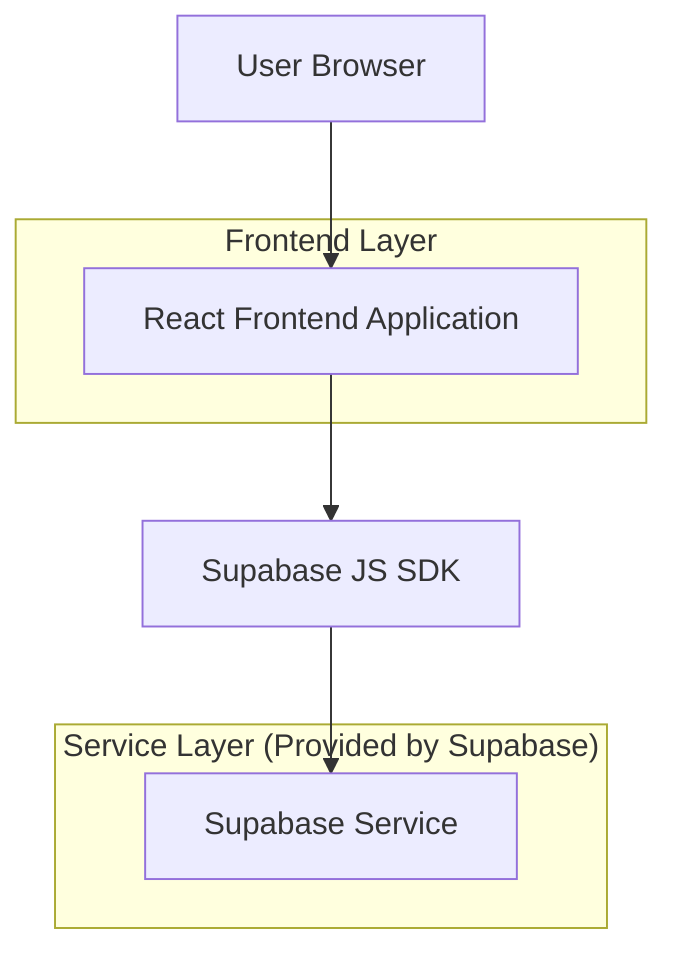
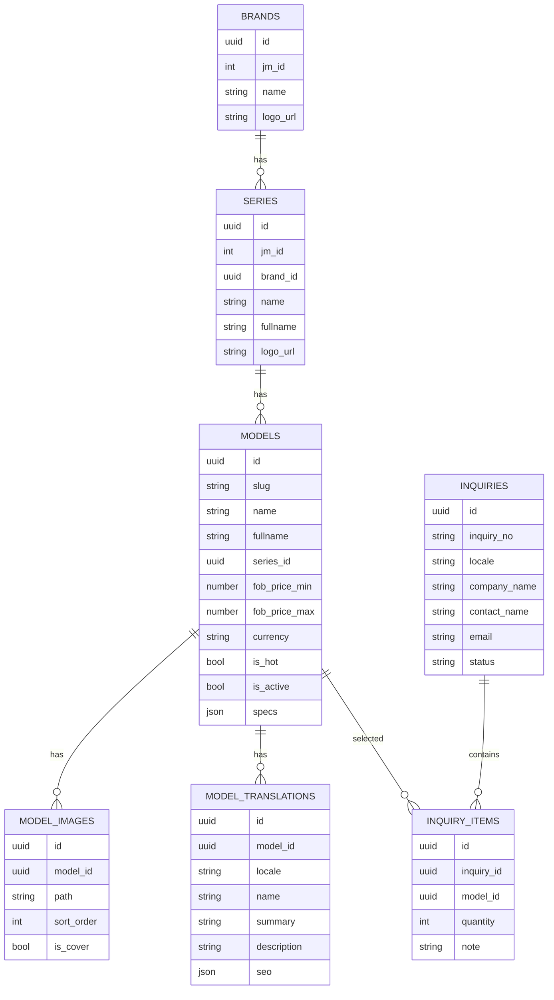

## 1.Architecture design


## 2.Technology Description
- Frontend: React@18 + react-router-dom + TypeScript + tailwindcss@3 + vite + i18next
- Backend: Supabase（PostgreSQL + Storage；前端通过 Supabase SDK 直接读写）

## 3.Route definitions
| Route | Purpose |
|---|---|
| /:locale/series/:id | 车系详情页：拉取车系信息与该车系车型列表，支持加入询盘与跳转车型详情 |
| /:locale/detail/:slug | 车型详情页（专业版）：展示主视觉、报价与加入询盘、参数/外观/内饰 Tabs、亮点与固定CTA |
| /:locale/inquiry | 询盘页（现有依赖）：提交已选车型与联系信息（本次改版不重做，但两页会写入选择状态） |

## 6.Data model(if applicable)

### 6.1 Data model definition


### 6.2 Data Definition Language
说明：本项目建议使用“逻辑外键”（应用层维护关系），默认不强制创建物理外键约束。

Brands（brands）
```sql
CREATE TABLE brands (
  id UUID PRIMARY KEY DEFAULT gen_random_uuid(),
  jm_id INTEGER NOT NULL,
  name TEXT NOT NULL,
  fullname TEXT,
  logo_url TEXT,
  created_at TIMESTAMPTZ DEFAULT NOW(),
  updated_at TIMESTAMPTZ DEFAULT NOW()
);
```

Series（series）
```sql
CREATE TABLE series (
  id UUID PRIMARY KEY DEFAULT gen_random_uuid(),
  jm_id INTEGER NOT NULL,
  brand_id UUID NOT NULL,
  name TEXT NOT NULL,
  fullname TEXT,
  logo_url TEXT,
  created_at TIMESTAMPTZ DEFAULT NOW(),
  updated_at TIMESTAMPTZ DEFAULT NOW()
);

CREATE INDEX idx_series_brand_id ON series(brand_id);
```

Models（models）
```sql
CREATE TABLE models (
  id UUID PRIMARY KEY DEFAULT gen_random_uuid(),
  series_id UUID,
  slug TEXT UNIQUE,
  name TEXT NOT NULL,
  fullname TEXT,
  fob_price_min NUMERIC,
  fob_price_max NUMERIC,
  currency TEXT NOT NULL DEFAULT 'GBP',
  is_hot BOOLEAN NOT NULL DEFAULT FALSE,
  is_active BOOLEAN NOT NULL DEFAULT TRUE,
  specs JSONB NOT NULL DEFAULT '{}'::jsonb,
  created_at TIMESTAMPTZ DEFAULT NOW(),
  updated_at TIMESTAMPTZ DEFAULT NOW()
);

CREATE INDEX idx_models_series_id ON models(series_id);
CREATE INDEX idx_models_is_active ON models(is_active);
CREATE INDEX idx_models_is_hot ON models(is_hot);
```

Model Images（model_images）
```sql
CREATE TABLE model_images (
  id UUID PRIMARY KEY DEFAULT gen_random_uuid(),
  model_id UUID NOT NULL,
  path TEXT NOT NULL,
  alt TEXT,
  sort_order INTEGER NOT NULL DEFAULT 0,
  is_cover BOOLEAN NOT NULL DEFAULT FALSE,
  created_at TIMESTAMPTZ DEFAULT NOW()
);

CREATE INDEX idx_model_images_model_id ON model_images(model_id);
CREATE INDEX idx_model_images_sort ON model_images(sort_order);
```

Model Translations（model_translations）
```sql
CREATE TABLE model_translations (
  id UUID PRIMARY KEY DEFAULT gen_random_uuid(),
  model_id UUID NOT NULL,
  locale TEXT NOT NULL,
  name TEXT NOT NULL,
  summary TEXT,
  description TEXT,
  seo JSONB NOT NULL DEFAULT '{}'::jsonb,
  updated_at TIMESTAMPTZ DEFAULT NOW(),
  UNIQUE(model_id, locale)
);

CREATE INDEX idx_model_translations_locale ON model_translations(locale);
```

RLS/权限（示例，按 Supabase 通用建议）
```sql
-- anon 允许基础读
GRANT SELECT ON brands TO anon;
GRANT SELECT ON series TO anon;
GRANT SELECT ON models TO anon;
GRANT SELECT ON model_images TO anon;
GRANT SELECT ON model_translations TO anon;

-- authenticated 允许完全访问（如需登录后管理）
GRANT ALL PRIVILEGES ON brands TO authenticated;
GRANT ALL PRIVILEGES ON series TO authenticated;
GRANT ALL PRIVILEGES ON models TO authenticated;
GRANT ALL PRIVILEGES ON model_images TO authenticated;
GRANT ALL PRIVILEGES ON model_translations TO authenticated;
```
