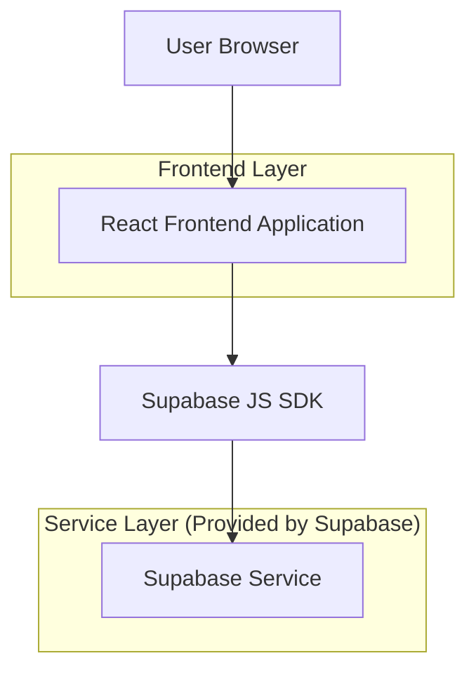
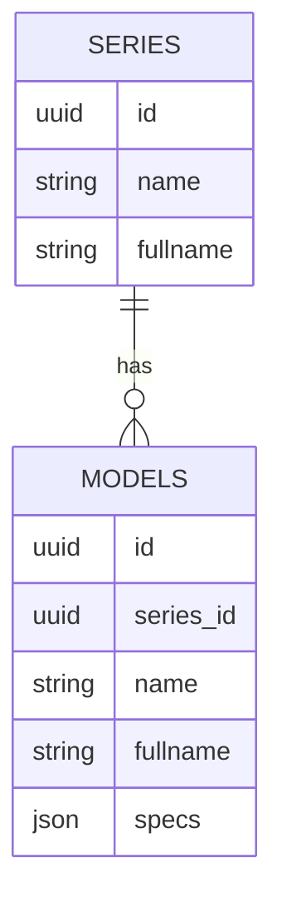

## 1.Architecture design

## 2.Technology Description
- Frontend: React@18 + react-router-dom + TypeScript + tailwindcss@3 + vite
- Backend: Supabase（PostgreSQL + Storage；前端通过 Supabase SDK 直接读取车系/车型与参数数据）

## 3.Route definitions
| Route | Purpose |
|---|---|
| /:locale/series/:id | 车系详情页（参数对比）：拉取车系信息、车型列表与参数；按年款分组并渲染横向对比表；顶部优先展示 VR（若可用） |

## 6.Data model(if applicable)

### 6.1 Data model definition
说明：本次为展示形态调整，复用既有数据结构；不新增表、不新增物理外键。

### 6.2 Data Definition Language
本次改版不涉及 DDL 变更。
