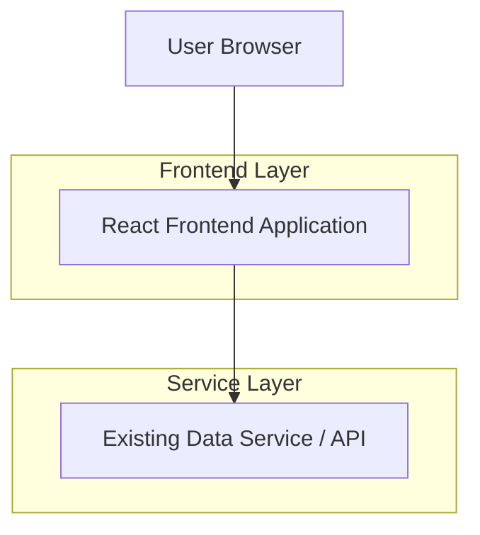

## 1.Architecture design

## 2.Technology Description
- Frontend: React + TypeScript（沿用现有项目技术栈）
- Backend: None（本需求不新增后端；沿用现有数据服务/接口）

## 3.Route definitions
| Route | Purpose |
|---|---|
| / | 首页车型列表，展示改版后的车型卡片（单列、一行一个、名称不截断、展示品牌/车系/关键参数、隐藏厂商指导价） |

## 4.API definitions (If it includes backend services)
本需求不新增/不改造后端 API；仅调整前端展示层字段渲染与布局逻辑。

## 6.Data model(if applicable)
本需求不新增数据实体；使用现有车型数据字段（品牌、车系、车型名称、关键参数集合/字段等）。
